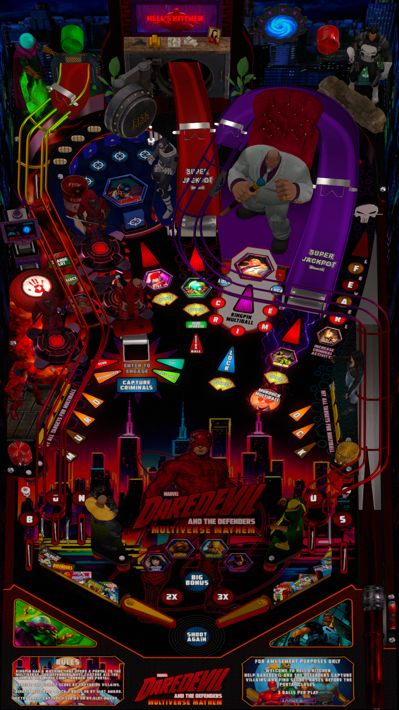

# Daredevil and The Defenders (Original 2024)

---

## Files
| File Type | Link | Version | Author | 
|-----------|--------|----------|--------------|
| **VPX** | [VPUniverse](https://vpuniverse.com/files/file/18196-daredevil-and-the-defenders-13/) | 1.3 | [Zandy'sArcade](https://vpuniverse.com/profile/57949-zandysarcade/) |
| **B2S** | [VPUniverse](https://vpuniverse.com/files/file/18208-daredevil-b2s-with-fulldmd/) | 1.0.0 |[Zandy'sArcade](https://vpuniverse.com/profile/57949-zandysarcade/) |
| **DMD** | N/A | N/A | N/A |
| **ROM** | N/A | N/A | N/A |

**Tested by:** [Bla1ze]

---

## Status

**Minimum VPX Standalone build:** 10.8.0-1983-b84441e

| Playfield | Controls | Backglass | DMD | ROM Required | FPS | 
|-----------|----------|-----------|-----|--------------|-----|
| :white_check_mark: | :white_check_mark: | :white_check_mark: | :white_check_mark: | :x: | 60 |

---

## Instructions

- Install this table through the Table Manager, using the `Add Table` > `Manual` page
- If you need help, more infomation found on the wiki: [TM - Add Table - Manual](https://github.com/LegendsUnchained/vpx-standalone-alp4k/wiki/%5B04%5D-%F0%9F%A7%A1-TM-%E2%80%90-Other-Features#add-table---manual)
- If the table requires any additional files/steps, click `GO TO TABLE` after adding, and the TM will open to the relevant table folder.
- To download the 1.3 version of this VPX table, click the link above and find the "CHANGELOG" and select "1.3". A download link will appear for 1.3
- If you can't stand the heat, stay out of Hell's Kitchen! 😈

