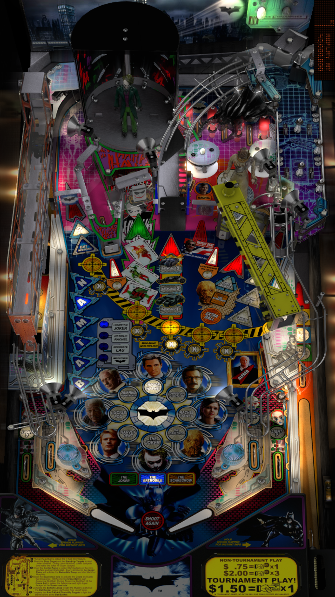

# Batman [The Dark Knight] (Stern 2008)

Author: [ninuzzu](https://vpuniverse.com/profile/5530-ninuzzu/)  
Version: 1.2  
Download: [VP Universe](https://vpuniverse.com/files/file/5490-batman-dark-knight/)

DirectB2S

Author: [Hauntfreaks](https://vpuniverse.com/profile/5216-hauntfreaks/)  
Version: 1.0.0  
Download: [VP Universe](https://vpuniverse.com/files/file/20212-batman-the-dark-knight-stern-2008-b2s-full-dmd/)

ROM (bdk_294)

Download: [VP Universe](https://vpuniverse.com/files/file/3389-batman-the-dark-knight-v294/)

SHA: 06ea19ff5a03f76052232f2bc67a7815f92b43ad  
MD5: 1083e55cef160e0b010fb22794244d07

Tested by: Bla1ze

## Status 

Minimum VPX Standalone build: 10.8.0-1983-a764013

| Playfield | Controls | Backglass | DMD | ROM Required | FPS | 
|-----------|----------|-----------|-----|--------------|-----|
| :white_check_mark: | :white_check_mark: | :white_check_mark: | :white_check_mark: | :white_check_mark: | 55 |

## Instructions

- Make sure to use the Table Manager to install this table.
- Instructions can be found on the wiki [Add Table - Manual](https://github.com/LegendsUnchained/vpx-standalone-alp4k/wiki/%5B04%5D-%F0%9F%A7%A1-TM-%E2%80%90-Other-Features#add-table---manual)
- If the table requires any additional files/steps, click `GO TO TABLE` after adding, and the TM will open to the relevant table folder.
- Why So Serious? 🃏

