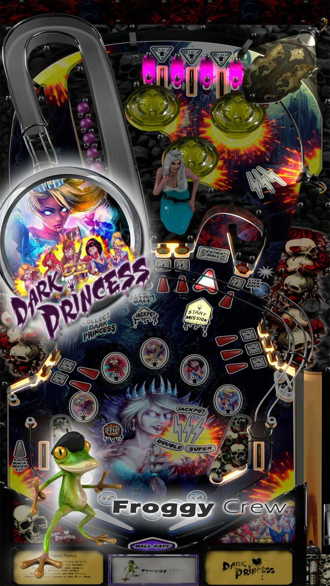

# DarkPrincess (original 2020)

Author: [emperor312 ](https://vpuniverse.com/profile/35296-emperor312/)  
Version: 1.3  
Download: [VP Universe](https://vpuniverse.com/files/file/8119-darkprincess-original-2020-v13-update-sound-files/)

DirectB2S and DarkPrincess.UltraDMD

In same folder as table in link above

Music

Download: [Mega](https://mega.nz/file/xmhH3TiI#kRQGDfJDISHJKz2B2GevtOKzp_DmjdN42XeVoLezEVg)

Tested by: Silentkat and Coffee@Joe's

## Status 

Minimum VPX Standalone build: 10.8.0-1989-a764013

| Playfield | Controls | Backglass | DMD | ROM Required | FPS | 
|-----------|----------|-----------|-----|--------------|-----|
| :white_check_mark: | :white_check_mark: | :white_check_mark: | :white_check_mark: | :x: | 57 |

## Instructions

- Copy the contents of this repo folder to your USB drive
- Add your personalized launcher.elf and rename it to vpx-darkprincess.elf
- Download the table, directb2s and DarkPrincess.UltraDMD listed above, extract and copy them into this folder
- Download music from the link above and extract. Rename (DarkPrincess-Music) folder to music and place it in your vpx-darkprincess folder
- Make sure (.vpx), (.directb2s), (.ini) and (.vbs) files are all named the same
