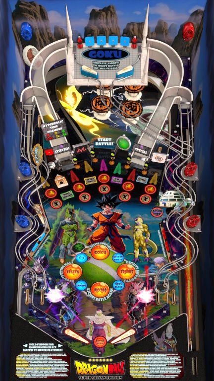

# Dragon Ball: Super Saiyan Edition (Original 2025)

---

## Files
| File Type | Link | Version | Author | 
|-----------|--------|----------|--------------|
| **VPX** | [VP Universe](https://vpuniverse.com/files/file/24788-dragonball-super-saiyan-edition-v10/) | 1.0 | [Cheese3075](https://vpuniverse.com/profile/73114-cheese3075/) |
| **B2S** | N/A | N/A | N/A |
| **DMD** | N/A | N/A | N/A |
| **ROM** | N/A | N/A | N/A |

**Tested by:** [mrandromeda]

---

## Status 
**Minimum VPX Standalone build:** 10.8.0-5b941e6
| Playfield | Controls | Backglass | DMD | ROM Required | FPS | 
|-----------|----------|-----------|-----|--------------|-----|
| :white_check_mark: | :white_check_mark: | :white_check_mark: | :white_check_mark: | :x: | 60 |

---

## Instructions
- Copy the contents of this repo folder to your USB drive
- Add your personalized launcher.elf and rename it to `vpx-dbsse.elf`
- Download the table from above link and copy it into `vpx-dbsse`
- Download the media pack from the same link above and extract the directb2s file and copy it into `vpx-dbsse`
- Make sure `(.vpx)` `(.direct2b2s)` `(.vbs)` and `(.ini)` are all named the same.
