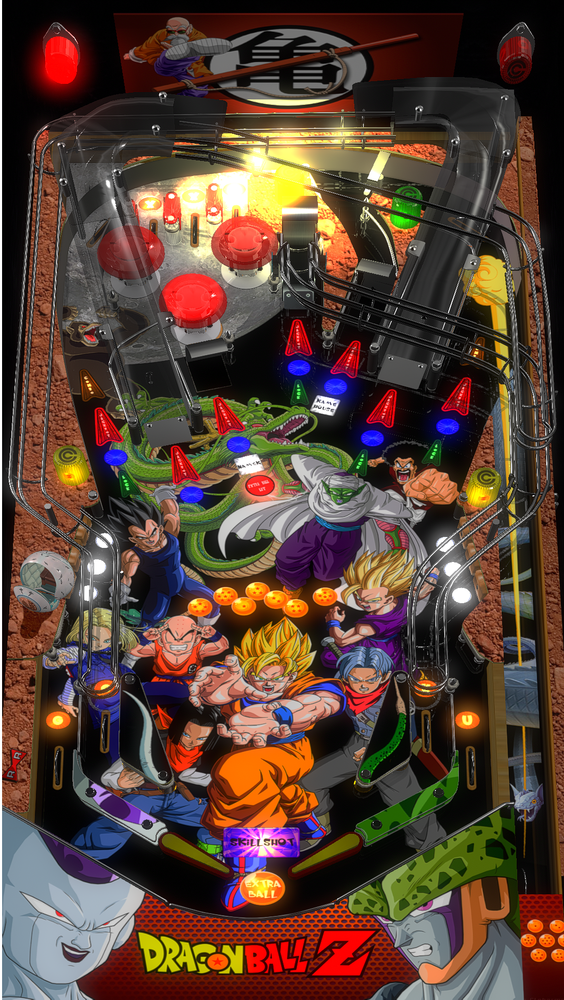

# Dragon Ball Z (Original 2018)

Authors: [Oly2](https://vpuniverse.com/profile/51096-oly2/)  
Version: 1.2  
Download: [VPUniverse](https://vpuniverse.com/files/file/14361-dragon-ball-z-oly-120/)

DirectB2S

Name: Dragon Ball Z 1.1.0 oly.directb2s  
Included in table download link

ROM

None

Media

Name: DBZ.rar  
Included in table download link

Tested by: evilwraith

## Status 

Minimum VPX Standalone build: 10.8.0-1989-a764013

| Playfield | Controls | Backglass | DMD | ROM Required | FPS | 
|-----------|----------|-----------|-----|--------------|-----|
| :white_check_mark: | :white_check_mark: | :white_check_mark: | :x: | :x: | 60 |

## Instructions

- Install this table through the Table Manager, using the `Add Table` > `Manual` page
- If you need help, more infomation found on the wiki: [TM - Add Table - Manual](https://github.com/LegendsUnchained/vpx-standalone-alp4k/wiki/%5B04%5D-%F0%9F%A7%A1-TM-%E2%80%90-Other-Features#add-table---manual)
- If the table requires any additional files/steps, click `GO TO TABLE` after adding, and the TM will open to the relevant table folder.
- Download the table, directb2s, and media listed above, extract (if necessary) and copy to external/vpx-dbz

