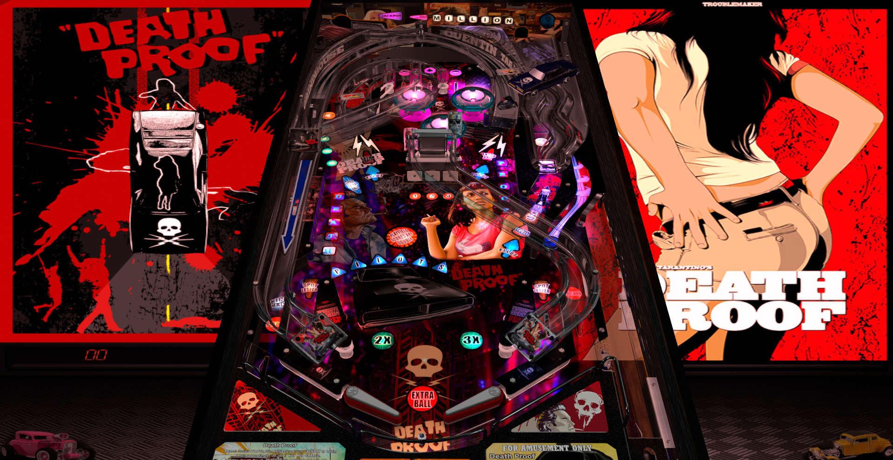

# Death Proof (Original 2021)

---

## Files
| File Type | Link | Version | Author | 
|-----------|--------|----------|--------------|
| **VPX** | [VP Universe](https://vpuniverse.com/files/file/8050-death-proof-by-balutito/) | 2.0 | [balutito](https://vpuniverse.com/profile/36070-balutito/) |
| **B2S** | [VP Universe](https://vpuniverse.com/files/file/15470-death-proof-balutito-2021-animated-b2s-with-full-dmd/) | 1.0.0 | [marcobus2005](https://vpuniverse.com/profile/53087-marcobus2005/) |
| **ROM** | [VP Forums](https://www.vpforums.org/index.php?app=downloads&showfile=933) | mousn_l4.zip | [destruk](https://www.vpforums.org/index.php?showuser=5) |

**Tested by:** [TechZombie]

---

## Status 
**Minimum VPX Standalone build:** {vpx-standalone-build-#}
| Playfield | Controls | Backglass | DMD | ROM Required | FPS | 
|-----------|----------|-----------|-----|--------------|-----|
| :white_check_mark: | :white_check_mark: | :white_check_mark: | :white_check_mark: | :white_check_mark: | 41 |

---

## Instructions

- Install this table through the Table Manager, using the `Add Table` > `Manual` page
- If you need help, more infomation found on the wiki: [TM - Add Table - Manual](https://github.com/LegendsUnchained/vpx-standalone-alp4k/wiki/%5B04%5D-%F0%9F%A7%A1-TM-%E2%80%90-Other-Features#add-table---manual)
- If the table requires any additional files/steps, click `GO TO TABLE` after adding, and the TM will open to the relevant table folder.
- Select/Copy Music Folder and move to `vpx-deathproof`
- "Well damn if you ain't so sweet you make sugar taste just like salt." - Stuntman Mike

