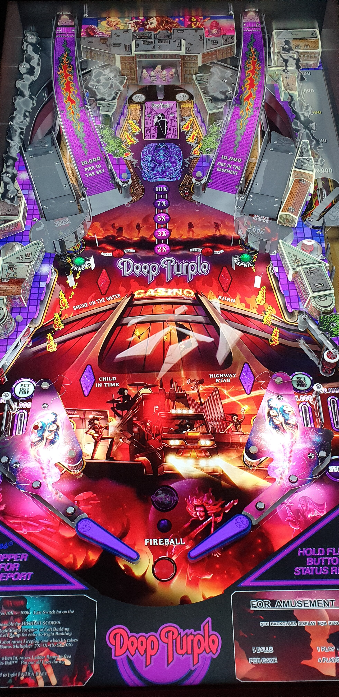

# Deep Purple (Original 2024)

Authors: [balutito](https://vpuniverse.com/profile/36070-balutito/)  
Version: 1.2  
Download: [VPUniverse](https://vpuniverse.com/files/file/21775-deep-purple/)

DirectB2S

Authors: [LAROUILLAS](https://vpuniverse.com/profile/46701-larouillas/)  
Download: [VPUniverse](https://vpuniverse.com/files/file/21783-deep-purple-balutito%C2%A02024-b2s-with-full-dmd/)

Media

Authors: [balutito](https://vpuniverse.com/profile/36070-balutito/)  
Download: [VPUniverse](https://vpuniverse.com/files/file/21775-deep-purple/)

Media Name: Music.rar

ROM

ROM Name: fire_l3.zip  
Download: [VPUniverse](https://vpuniverse.com/files/file/21775-deep-purple/)  

SHA1: 1FCC714F8BF905FBF323660D611ED1EED7209727  
MD5:  7F0EEF1460F0C27B6A961CC31E53CE0B 

Tested by: Bruno15477 and evilwraith

## Status 

Minimum VPX Standalone build: 10.8.0-1989-a764013

| Playfield | Controls | Backglass | DMD | ROM Required | FPS | 
|-----------|----------|-----------|-----|--------------|-----|
| :white_check_mark: | :white_check_mark: | :white_check_mark: | :white_check_mark: | :white_check_mark: | 45 |

## Instructions

- Install this table through the Table Manager, using the `Add Table` > `Manual` page
- If you need help, more infomation found on the wiki: [TM - Add Table - Manual](https://github.com/LegendsUnchained/vpx-standalone-alp4k/wiki/%5B04%5D-%F0%9F%A7%A1-TM-%E2%80%90-Other-Features#add-table---manual)
- If the table requires any additional files/steps, click `GO TO TABLE` after adding, and the TM will open to the relevant table folder.
- Download the media listed above, extract and copy to external/vpx-deeppurple/Music

