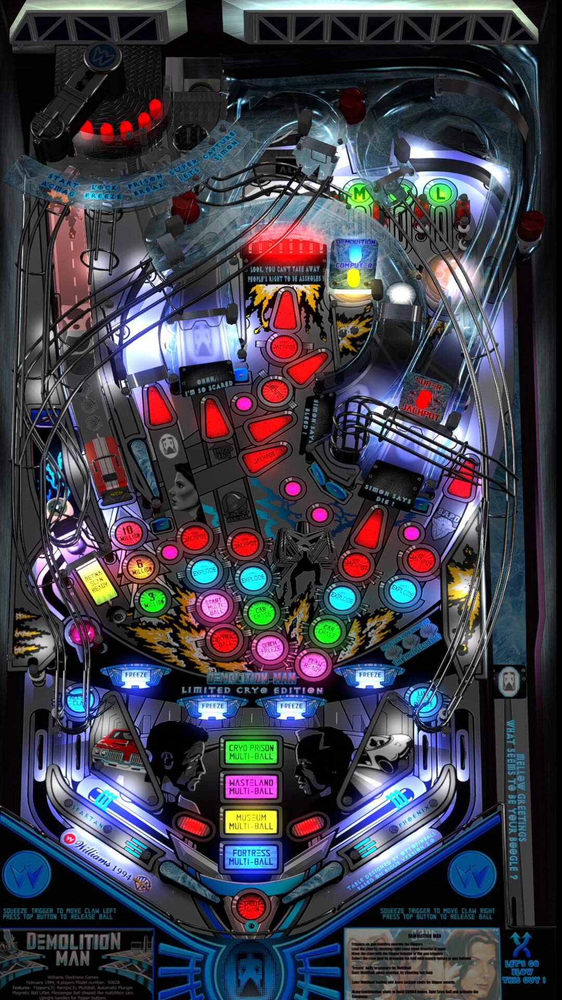

# Demolition Man (Williams 1994) - Limited Cryo Edition

---

## Files
| File Type | Link | Version | Author | 
|-----------|--------|----------|--------------|
| **VPX** | [VPUniverse](https://vpuniverse.com/files/file/20903-demolition-man-williams-1994-limited-cryo-edition-ottopinball-mod/) | 1.0.1 | OttOBuS59 |
| **B2S & DMD** | [VPUniverse](https://vpuniverse.com/files/file/12716-demolition-man-williams-1994-b2s-with-full-dmd/) |  | [hauntfreaks](https://vpuniverse.com/profile/5216-hauntfreaks/) |
| **ROM** | [VPForums](https://www.vpforums.org/index.php?app=downloads&showfile=1307) | dm_lx4.zip  **SHA1:** DEC6DDE55D3CECA5C9093B0CEB960FD35EB4E4B1  **MD5:**  104F6D8613008824972DCAAE3975E85B  | [VPForums](https://www.vpforums.org/index.php?app=downloads&showfile=1307) |

**Tested by:** [TechZombie]

---

## Status 

**Minimum VPX Standalone build:** 10.8.0-1989-a764013

| Playfield | Controls | Backglass | DMD | ROM Required | FPS | 
|-----------|----------|-----------|-----|--------------|-----|
| :white_check_mark: | :white_check_mark: | :white_check_mark: | :white_check_mark: | :white_check_mark: | 40 |

---

## Instructions

- Make sure to use the Table Manager to install this table.
- Instructions can be found on the wiki [Add Table - Manual](https://github.com/LegendsUnchained/vpx-standalone-alp4k/wiki/%5B04%5D-%F0%9F%A7%A1-TM-%E2%80%90-Other-Features#add-table---manual)
- If the table requires any additional files/steps, click `GO TO TABLE` after adding, and the TM will open to the relevant table folder.
> ohn Spartan: "So much for the seashells. See you in a few minutes."

