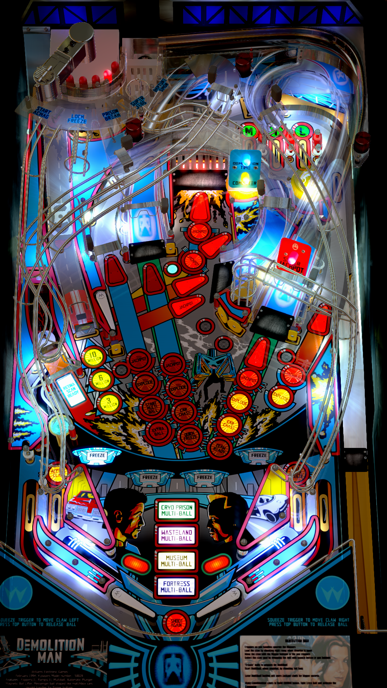

# Demolition Man (Williams 1994)

Authors: Knorr-Kiwi  
Version: 1.3.1  
Download: [VPUniverse](https://vpuniverse.com/files/file/3743-demolition-man-williams1994knorr-kiwifs-dtvp10/)

DirectB2S

Authors: [hauntfreaks](https://vpuniverse.com/profile/5216-hauntfreaks/)  
Download: [VPUniverse](https://vpuniverse.com/files/file/12716-demolition-man-williams-1994-b2s-with-full-dmd/)

ROM

ROM Name: dm_lx4.zip  
Download: [VPForums](https://www.vpforums.org/index.php?app=downloads&showfile=1307)  

SHA1: DEC6DDE55D3CECA5C9093B0CEB960FD35EB4E4B1  
MD5:  104F6D8613008824972DCAAE3975E85B 

Tested by: evilwraith

## Status 

Minimum VPX Standalone build: 10.8.0-1989-a764013

| Playfield | Controls | Backglass | DMD | ROM Required | FPS | 
|-----------|----------|-----------|-----|--------------|-----|
| :white_check_mark: | :white_check_mark: | :white_check_mark: | :white_check_mark: | :white_check_mark: | 42 |

## Instructions

- Copy the contents of this repo folder to your USB drive
- Add your personalized launcher.elf and rename it to vpx-demoman.elf
- Download the table and directb2s listed above, extract (if necessary) and copy to external/vpx-demoman
- Make sure (.vpx), (.directb2s), and (.ini) files are all named the same
- The ROM zip file gets copied to vpx-demoman/pinmame/roms (Do not unzip)

