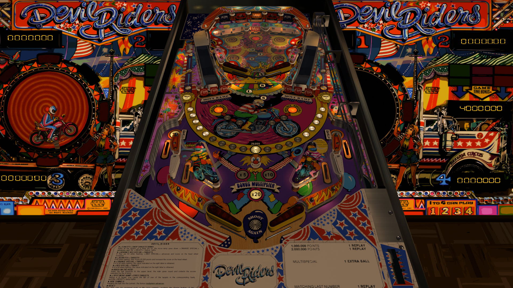

# Devil Riders (Zaccaria 1984)
Tested By: kaoticBPR

Original Table:
Authors: [goldchicco](https://www.vpforums.org/index.php?showuser=88795)
Version: 1.1
Download: [vpforums](https://www.vpforums.org/index.php?app=downloads&showfile=15390)

Patch File:
Authors: [balutito](https://vpuniverse.com/profile/36070-balutito/)
Version: 1.0
Download: [vpuniverse](https://vpuniverse.com/files/file/15570-devil-riders-zaccaria-1984-balutito-4k/)

Download VPURemix application
Download: https://vpuniverse.com/files/file/2581-vpuremix-system-vppatching-system-vpx-only/?do=download

DirectB2S

Authors: [Wildman](https://vpuniverse.com/profile/5-wildman/)
Version: 1.0
Download: [vpuniverse](https://vpuniverse.com/files/file/2481-devil-riders-zaccaria-1984/)

ROM

Download: [vpforums](http://www.vpforums.org/index.php?app=downloads&showfile=615)
ROM Name and version: dvlrider

## Status 

Minimum VPX Standalone build: 10.8.0-1989-a764013
| Playfield | Controls | Backglass | DMD | ROM Required | FPS | 
|-----------|----------|-----------|-----|--------------|-----|
| :white_check_mark: | :white_check_mark: | :white_check_mark: | :white_check_mark: | :white_check_mark: | 45 |

## Instructions

- Copy the contents of this repo folder to your USB drive
- Add your personalized launcher.elf and rename it to vpx-devilriders.elf
- Download the Original table, the updated table dif file, VPURemix application, and directb2s versions listed above
- open VPURemix app, place original table in source slot, and the dif file in patch slot.
- name the output or new table Devil Riders (Zaccaria 1984).vpx and hit patch it
- Take new vpx file, direct2bs, and ini and make sure they are all named the same and place them in the /external/vpx-devilriders folder
- Again, Make sure the vpx, direct2b, and ini files are all named the "exact" same
- Place dvlrider.zip in the external/vpx-devilriders/pinmame/roms folder *Do Not unzip*
- "Spin your wheels thru the wheel of death"

