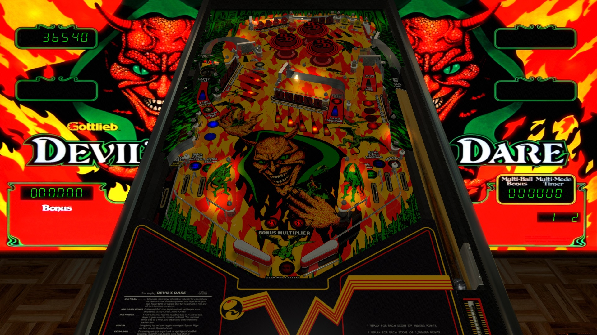

# Devil's Dare (Gottlieb 1982)

## Files
| File Type | Link | Version | Author | 
|-----------|--------|----------|--------------|
| **VPX** | [VPUniverse](https://vpuniverse.com/files/file/6603-devils-dare-gottlieb-1992/) | 1.0.a | [goldchicco](https://vpuniverse.com/profile/23579-goldchicco/) |
| **B2S** | [VPUniverse](https://vpuniverse.com/files/file/16031-devils-dare-gottlieb-1992-b2s-pre-production/) | 1.0 | [hauntfreaks](https://vpuniverse.com/profile/5216-hauntfreaks/) |
| **ROM** | [PinballNirvana](https://pinballnirvana.com/forums/resources/devils-dare-gottlieb-1982-vp8-by-patatrox.2859/) | 0.31 | [patatrox](Not Registered) |

**Tested by:** [vicpac73]

---

## Status 
**Minimum VPX Standalone build:** {10.8.0-2042-1431983}

| Playfield | Controls | Backglass | DMD | ROM Required | FPS | 
|-----------|----------|-----------|-----|--------------|-----|
| :white_check_mark: | :white_check_mark: | :white_check_mark: | :x: | :white_check_mark: | 57 |

---

## Instructions

- Copy the contents of this repo folder to your USB drive
- Add your personalized launcher.elf and rename it to `vpx-devilsdare.elf`
- Download the table and directb2s versions listed above, extract (if necessary) and copy them into `external/vpx-devilsdare`
- Place ROM zip file into `vpx-devilsdare/pinmame/roms` folder. DO NOT UNZIP!
- Make sure `(.vpx)`, `(.directb2s)` and `(.ini)` are all named the same.

