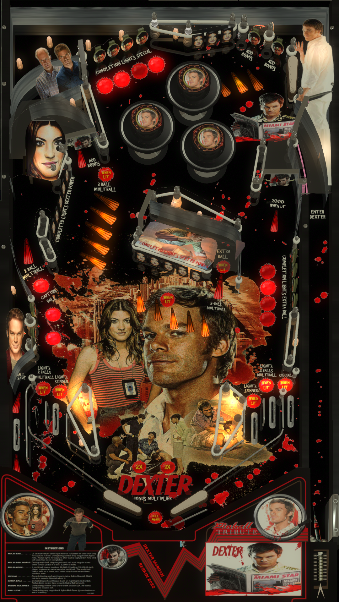

# {Dexter} ({Original} {2022})

---

## Files
| File Type | Link | Version | Author | 
|-----------|--------|----------|--------------|
| **VPX** |  [Vpuniverse]  (lhttps://vpuniverse.com/files/file/11395-dexter/}) | 1.0.0 |  iceman 2022 (https://vpuniverse.com/profile/4306-icepinball/}
| **B2S** |  [Vpuniverse]  (lhttps://vpuniverse.com/files/file/11395-dexter/}) | 1.0.0 |  iceman 2022 (https://vpuniverse.com/profile/4306-icepinball/}
| **ROM** |  [vpforum} {https://www.vpforums.org/index.php?app=downloads&showfile=15871}) | 1.0a | [Goldchicco}  (https://www.vpforums.org/index.php?s=54c41d7c702de5e5bdf00851af6ace91&showuser=88795}

**Tested by:** [{rocjr73}]

---

## Status 
**Minimum VPX Standalone build:** 10.8.0-2042-1431983
| Playfield | Controls | Backglass | DMD | ROM Required | FPS | 
|-----------|----------|-----------|-----|--------------|-----|
| :white_check_mark: | :white_check_mark: | :white_check_mark: | :x: | :white_check_mark: | 60 |

---

## Instructions
- Copy the contents of this repo folder to your USB drive
- Add your personalized launcher.elf and rename it to `vpx-{dexter}.elf`
- Download the table and directb2s versions listed above, extract (if necessary) and copy them into `vpx-{dexter}`
- Rom file (dvlsdre.zip) stays in zip folder, place zip file in `vpx-{dexter}/pinmame/roms`
- Make sure `(.vpx)` `(.direct2b2s)` `(.vbs)` and `(.ini)` are all named the same.
