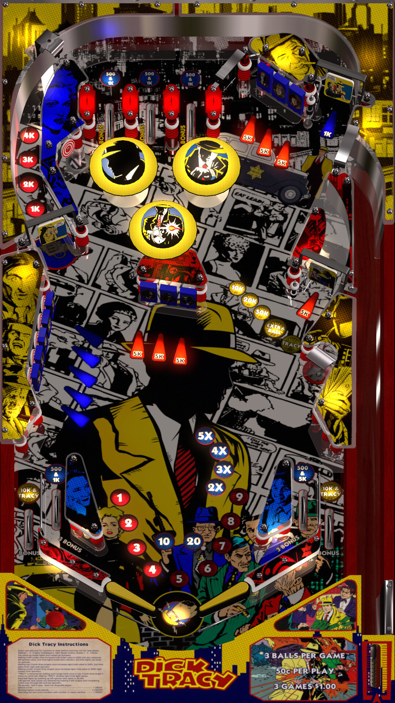

# Dick Tracy (Original 2024)

Authors: [Rocketeer84](https://vpuniverse.com/profile/62204-rocketeer84/)  
Version: 1.1  
Download: [VPUniverse](https://vpuniverse.com/files/file/19687-dick-tracy-2024/)

DirectB2S

Included with table

FlexDMD

[Mega](https://mega.nz/file/nxokBAzC#9DiNdrlyO9QRigHRMEM4nN69l9Vd1FDNsG_AndNa7Zs)

ROM

ROM Name: vortex.zip  
Download: [VPUniverse](https://vpuniverse.com/files/file/1374-vortexzip/)  

SHA1: 5C5D3EA7DBF0AFE3C608E08AB02D62BD357AC7F5  
MD5:  86443FA0F0CAF72918A14C54C04679CF

Tested by: evilwraith

## Status 

Minimum VPX Standalone build: 10.8.0-1989-a764013

| Playfield | Controls | Backglass | DMD | ROM Required | FPS | 
|-----------|----------|-----------|-----|--------------|-----|
| :white_check_mark: | :white_check_mark: | :white_check_mark: | :white_check_mark: | :white_check_mark: | 60 |

## Instructions

- Install this table through the Table Manager, using the `Add Table` > `Manual` page
- If you need help, more infomation found on the wiki: [TM - Add Table - Manual](https://github.com/LegendsUnchained/vpx-standalone-alp4k/wiki/%5B04%5D-%F0%9F%A7%A1-TM-%E2%80%90-Other-Features#add-table---manual)
- If the table requires any additional files/steps, click `GO TO TABLE` after adding, and the TM will open to the relevant table folder.
- Download the FlexDMD listed above, extract (if necessary) and copy to external/vpx-dicktracy

