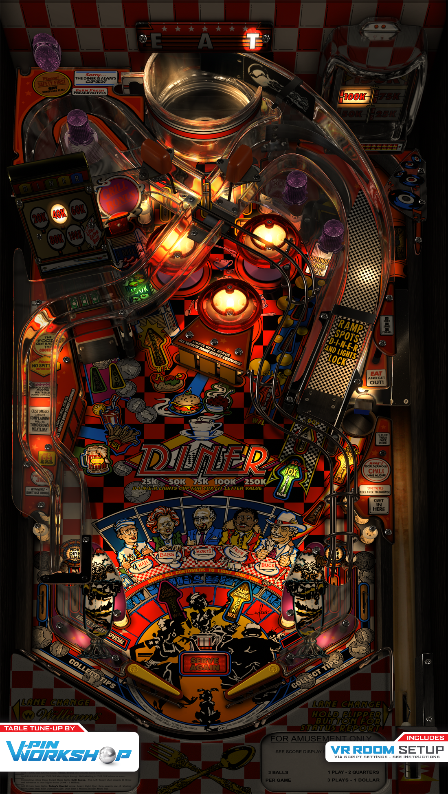

# Diner (Williams 1990)

Authors: [VPinWorkshop](https://vpuniverse.com/profile/40692-vpinworkshop/)  
Version: 1.02  
Download: [VP Universe](https://vpuniverse.com/files/file/10699-diner-williams-1990-vpw-mod/)

DirectB2S

Authors: [Blacksad](https://vpuniverse.com/profile/9127-blacksad/)  
Version: 1.0  
Download: [VP Universe](https://vpuniverse.com/files/file/4892-diner-williams-1990-2-3-screens-db2s/)

ROM

Download: [VP Forums](https://www.vpforums.org/index.php?app=downloads&showfile=948)

Color DMD

Author: [ebor](https://vpuniverse.com/profile/29168-ebor/)  
Download: [VP Universe](https://vpuniverse.com/files/file/15442-diner-williams-1990-dmd-64-colors-serum-format/)

## Status

Minimum VPX Standalone build: 10.8.0-1989-a764013

| Playfield | Controls | Backglass | DMD | ROM Required | FPS | 
|-----------|----------|-----------|-----|--------------|-----|
| :white_check_mark: | :white_check_mark: | :white_check_mark: | :white_check_mark: | :white_check_mark: | 40 |

## Instructions

- Copy the contents of this repo folder to your USB drive
- Add your personalized launcher.elf and rename it to vpx-diner.elf
- Download the table and directb2s versions listed above and copy them into this folder
- Make sure (.vpx), (.directb2s), (.ini) and (.vbs) files are all named the same
- Place ROM zip file into vpx-diner/pinmame/roms folder. DO NOT UNZIP!
- Place the color DMD (.cRZ) file in "external\vpx-diner\pinmame\altcolor\diner_l4" (create the folders if needed)

