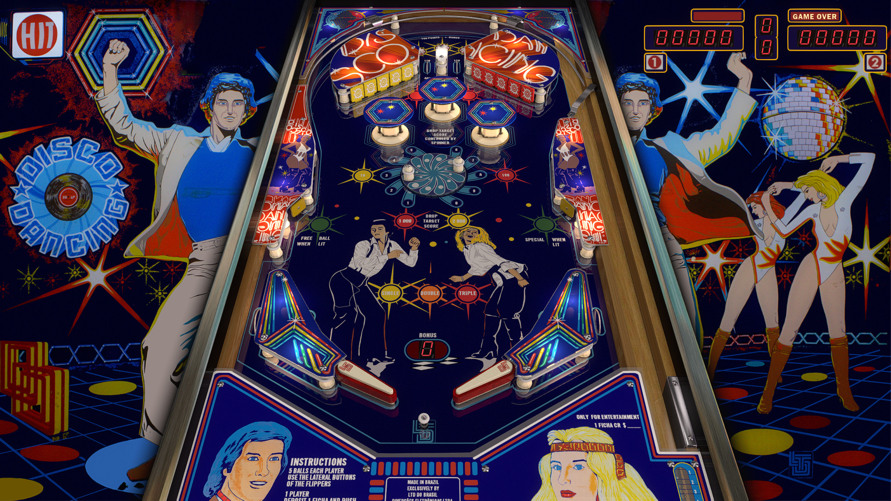

# Disco Dancing(LTD do Brasil 1979)

---

## Files
| File Type | Link | Version | Author | 
|-----------|--------|----------|--------------|
| **VPX** | [VPForums](https://www.vpforums.org/index.php?app=downloads&showfile=17085) | 5.5.0 | [jpsalas](https://www.vpforums.org/index.php?showuser=277) |
| **B2S** | `Disco Dancing.directb2s.zip` included in VPX link |
| **ROM** | `discodan.zip` included in VPX link | | |

**Tested by:** Curt

---

## Status 
**Minimum VPX Standalone build:** 10.8.0-1989-a764013

| Playfield | Controls | Backglass | DMD | ROM Required | FPS | 
|-----------|----------|-----------|-----|--------------|-----|
| :white_check_mark: | :white_check_mark: | :white_check_mark: | :x: | :white_check_mark: | 60 |

---

## Instructions

- Copy the contents of this repo folder to your USB drive
- Add your personalized launcher.elf and rename it to `vpx-discodancing.elf`
- Download the table and directb2s versions listed above, extract, and copy them into `vpx-discodancing`
- Rom file `(discodan.zip)`, stays in zip folder, place zip file in `vpx-discodancing/pinmame/roms`
- Make sure `(.vpx)` `(.directb2s)` `(.vbs)` and `(.ini)` are all named the same.
