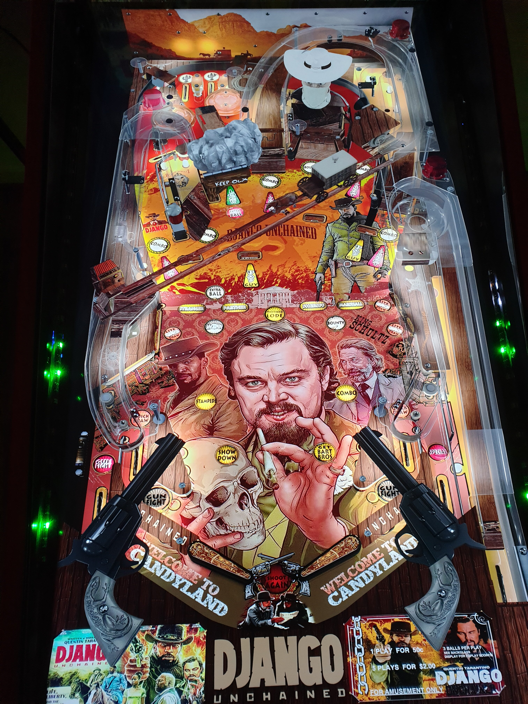

# Django Unchained (Original 2022)

Authors: [balutito](https://vpuniverse.com/profile/36070-balutito/)  
Filename: Django v1 music only.vpx (1.2)  
Download: [VP Universe](https://vpuniverse.com/files/file/9690-django-unchained-balutito-mod/)

DirectB2S

Authors: [balutito](https://vpuniverse.com/profile/36070-balutito/)  
Filename: Django.directb2s (1.2)  
Download: [VP Universe](https://vpuniverse.com/files/file/9691-backgkass-and-b2s-for-django-unchained-balutito-mod/)

Music + ROM

Download: [VP Universe](https://vpuniverse.com/files/file/9690-django-unchained-balutito-mod/)  
Filename: Django Rom + Music +Altcolor.rar

Tested by: TechZombie

## Status 

Minimum VPX Standalone build: 10.8.0-1989-a764013

| Playfield | Controls | Backglass | DMD | ROM Required | FPS | 
|-----------|----------|-----------|-----|--------------|-----|
| :white_check_mark: | :white_check_mark: | :white_check_mark: | :white_check_mark: | :white_check_mark: | 45 |

## Instructions

- Make sure to use the Table Manager to install this table.
- Instructions can be found on the wiki [Add Table - Manual](https://github.com/LegendsUnchained/vpx-standalone-alp4k/wiki/%5B04%5D-%F0%9F%A7%A1-TM-%E2%80%90-Other-Features#add-table---manual)
- If the table requires any additional files/steps, click `GO TO TABLE` after adding, and the TM will open to the relevant table folder.
- Unzip (Django Rom + Music +Altcolor.rar) Copy (music) folder to vpx-djangounchained
- "Kill white folks and they pay you for it? What's not to like?" - Django

