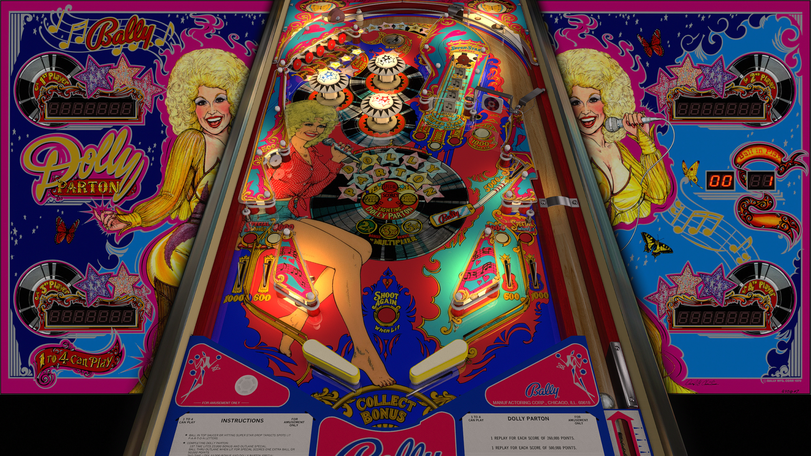

# Dolly Parton (Bally 1979)

Authors: [JPSalas](https://www.vpforums.org/index.php?showuser=277)  
Version: 5.5.0  
Download: [VPForums](https://www.vpforums.org/index.php?app=downloads&showfile=12917)

DirectB2S

Authors: [ryguy417](https://vpuniverse.com/profile/31096-ryguy417/)  
Download: [VPUniverse](https://vpuniverse.com/files/file/13456-dolly-parton-bally-1978-b2s-with-full-dmd/)

ROM

Authors: [destruk](https://www.vpforums.org/index.php?showuser=5)  
Download: [VPForums](https://www.vpforums.org/index.php?app=downloads&showfile=693)

Tested by: evilwraith

## Status 

Minimum VPX Standalone build: 10.8.0-1989-a764013

| Playfield | Controls | Backglass | DMD | ROM Required | FPS | 
|-----------|----------|-----------|-----|--------------|-----|
| :white_check_mark: | :white_check_mark: | :white_check_mark: | :x: | :white_check_mark: | 60 |

## Instructions

- Copy the contents of this repo folder to your USB drive
- Add your personalized launcher.elf and rename it to vpx-dolly.elf
- Download the table and directb2s listed above, extract (if necessary) and copy all contents to external/vpx-dolly
- Make sure (.vpx), (.directb2s), and (.ini) files are all named the same
- The ROM zip file gets copied to vpx-dolly/pinmame/roms (do not unzip)
- "I'm not offended by all the dumb blonde jokes because I know I'm not dumb...and I also know that I'm not blonde."
