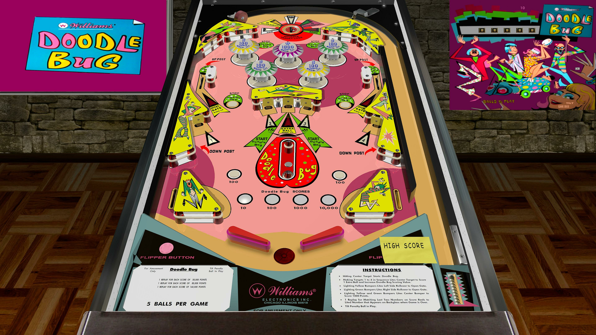

# Doodle Bug (Williams 1971)

Authors: [loserman76](https://vpuniverse.com/profile/2798-loserman76/)  
Version: 1.0.0f  
Download: [VPUniverse](https://vpuniverse.com/files/file/8347-doodle-bug-williams-1971/)

DirectB2S

Download included with table

ROM

None

Tested by: vicpac73

## Status 

Minimum VPX Standalone build: 10.8.0-1989-a764013

| Playfield | Controls | Backglass | DMD | ROM Required | FPS | 
|-----------|----------|-----------|-----|--------------|-----|
| :white_check_mark: | :white_check_mark: | :white_check_mark: | :x: | :x: | 47 |

## Instructions

- Install this table through the Table Manager, using the `Add Table` > `Manual` page
- If you need help, more information found on the wiki: [TM - Add Table - Manual](https://github.com/LegendsUnchained/vpx-standalone-alp4k/wiki/%5B04%5D-%F0%9F%A7%A1-TM-%E2%80%90-Other-Features#add-table---manual)
- If the table requires any additional files/steps, click `GO TO TABLE` after adding, and the TM will open to the relevant table folder.

