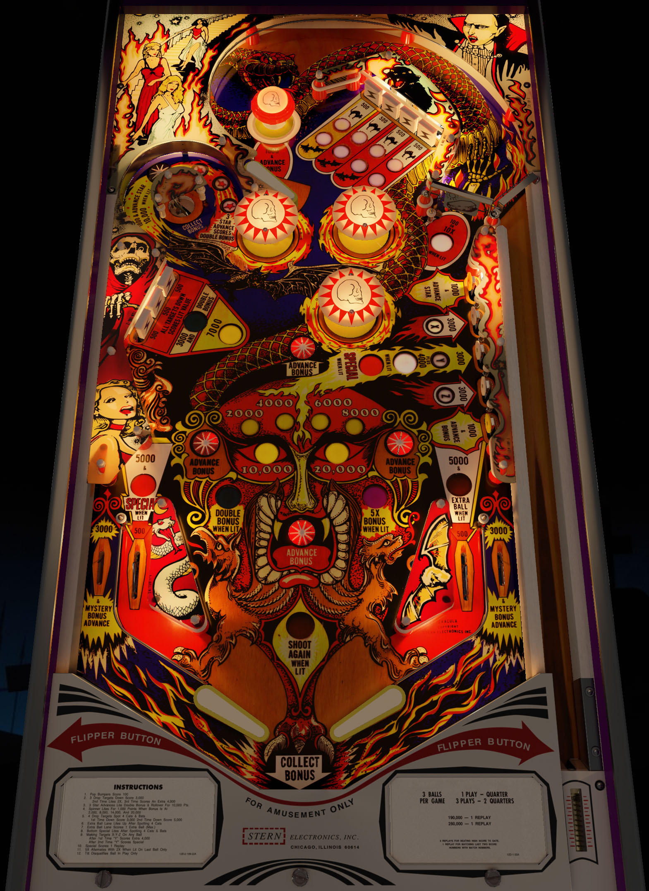

# Dracula (Stern 1979)

Authors: [bord](https://vpuniverse.com/profile/9265-bord/)
Version: 2.1.1
Download: [VPUniverse](https://vpuniverse.com/files/file/11998-dracula-stern-1979/)

DirectB2S

Authors: [HauntFreaks](https://vpuniverse.com/profile/5216-hauntfreaks/)
Version: v2.5
Download: [VPUniverse](https://vpuniverse.com/files/file/12008-dracula-stern-1979-b2s/)

ROM

Download: [vpforums](https://www.vpforums.org/index.php?app=downloads&showfile=733)
ROM Name and version: dracula.zip

## Status 

Minimum VPX Standalone build: 10.8.0-1989-a764013
| Playfield | Controls | Backglass | DMD | ROM Required | FPS | 
|-----------|----------|-----------|-----|--------------|-----|
| :white_check_mark: | :white_check_mark: | :white_check_mark: | :white_check_mark: | :white_check_mark: | 53 |

## Instructions

- Install this table through the Table Manager, using the `Add Table` > `Manual` page
- If you need help, more information found on the wiki: [TM - Add Table - Manual](https://github.com/LegendsUnchained/vpx-standalone-alp4k/wiki/%5B04%5D-%F0%9F%A7%A1-TM-%E2%80%90-Other-Features#add-table---manual)
- If the table requires any additional files/steps, click `GO TO TABLE` after adding, and the TM will open to the relevant table folder.
- "He wants to suck your blood"

