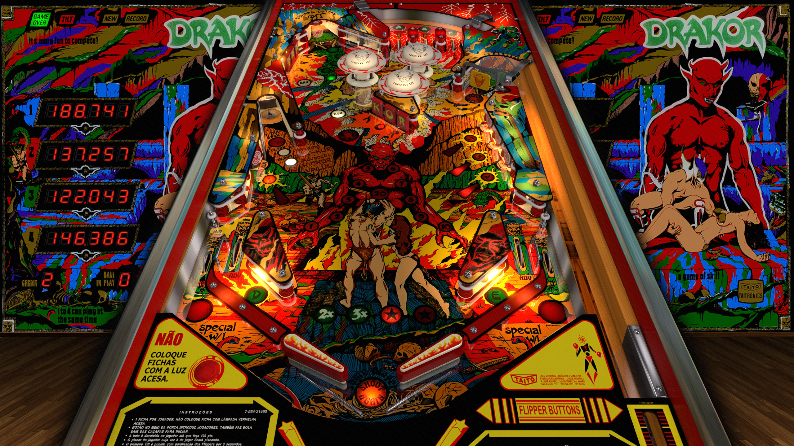

# Drakor (Taito do Brasil 1979)

Table

Authors: [JPSalas](https://www.vpforums.org/index.php?showuser=277)  
Version: 5.5.0  
Download: [VP Forums](https://www.vpforums.org/index.php?s=4f2961675eb26d02e587381de15efd78&app=downloads&showfile=13470)

DirectB2S

Authors: [Wildman](https://vpuniverse.com/profile/5-wildman/)  
Version: 2.0  
Download: [VP Universe](https://vpuniverse.com/files/file/4977-drakor-taito-1979/)

ROM

Download: [VP Forums](https://www.vpforums.org/index.php?app=downloads&showfile=555)

Tested by: Boris

## Status 

Minimum VPX Standalone build: 10.8.0-1989-a764013

| Playfield | Controls | Backglass | DMD | ROM Required | FPS | 
|-----------|----------|-----------|-----|--------------|-----|
| :white_check_mark: | :white_check_mark: | :white_check_mark: | :x: | :white_check_mark: | 60 |

## Instructions

- Copy this repo folder into the "external" folder on your USB drive
- Add your personalized launcher.elf and rename it to vpx-drakor.elf
- Download the table and directb2s versions listed above, extract them (if necessary) and copy them to external/vpx-drakor
- Make sure any (.vpx), (.directb2s), (.vbs), and (.ini) files are all named the same
- Download the ROM listed above and copy it to vpx-drakor\pinmame\roms. DO NOT UNZIP!
- Drakor is a Brazilian clone of the 1979 Williams table Gorgar

