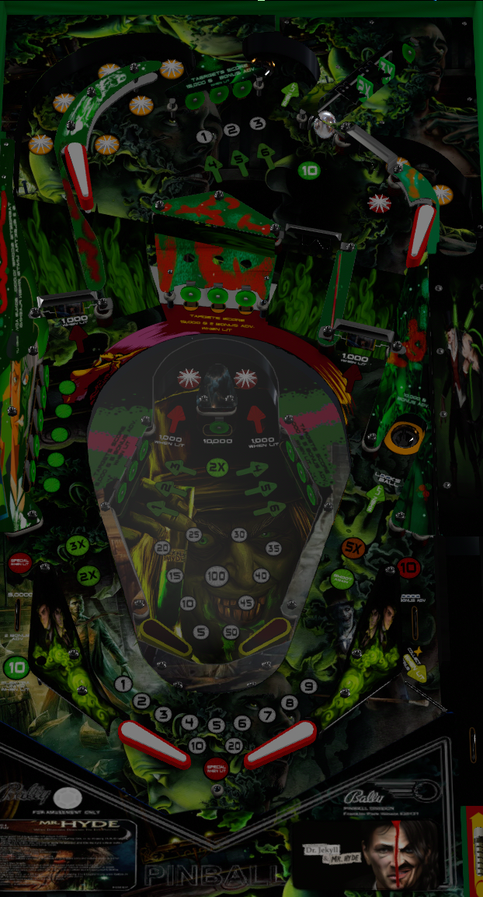

# Dr. Jekyll and Mr. Hyde (Original 2022)

Authors: [BurtMacklin](https://vpuniverse.com/profile/39250-burtmacklin/)  
Download File: Dr. Jekyll and Mr. Hyde V1.3.7z  
Filename: Dr. Jekyll and Mr. Hyde 1.3.vpx  
Download: [VP Universe](https://vpuniverse.com/files/file/10342-dr-jekyll-and-mr-hyde-reskin-vpx-table/)

DirectB2S Included with Table zip  
Filename: Dr. Jekyll and Mr. Hyde 2 screen.directb2s

Music Included with Table zip  
Filenames: music (encoded at FULL VOLUME) and music (encoded at LOWER VOLUME) **Choose Only One Folder**

Rom

Authors: [destruk](https://www.vpforums.org/index.php?showuser=5)  
Filename: elektra.zip  
Download: [VPforums](https://www.vpforums.org/index.php?app=downloads&showfile=657)

Tested by: TechZombie

## Status 

Minimum VPX Standalone build: 10.8.0-1989-a764013

| Playfield | Controls | Backglass | DMD | ROM Required | FPS | 
|-----------|----------|-----------|-----|--------------|-----|
| :white_check_mark: | :white_check_mark: | :white_check_mark: | :x: | :white_check_mark: | 45 |

## Instructions

- Copy the contents of this repo folder to your USB drive
- Add your personalized launcher.elf and rename it to vpx-drjekyllandmrhyde.elf
- Download the table and directb2s listed above, extract (if necessary) and copy them to external/vpx-drjekyllandmrhyde
- Make sure (.vpx), (.directb2s), (.ini), and (.vbs) files are all named the same
- Choose either Full Volume or Lower Volume and rename folder to (music) then Copy (music) folder to vpx-drjekyllandmrhyde
- Rom file (elektra.zip) stays in zip folder, place zip file in vpx-drjekyllandmrhyde/pinmame/roms
- "It is one thing to mortify curiosity, another to conquer it." - Dr. Jekyll

