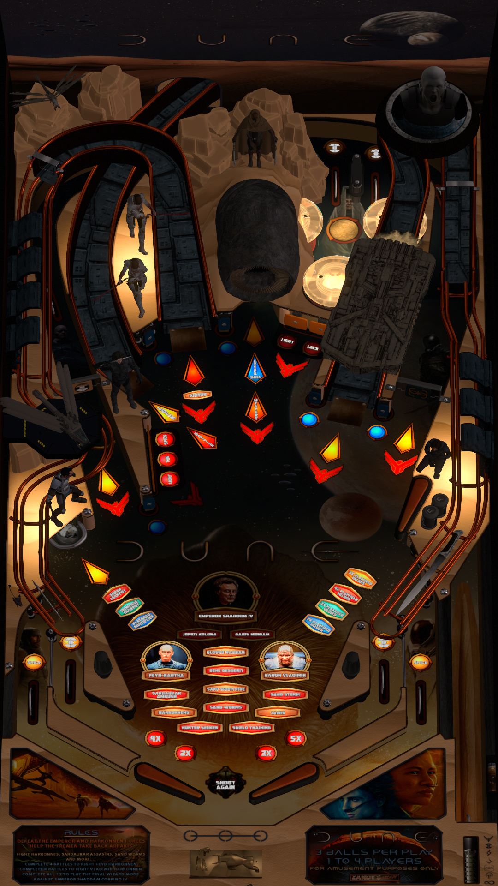

# DUNE

Author: [ZandysArcade](https://vpuniverse.com/profile/57949-zandysarcade/) 

Tested by: Bla1ze 

Version: 1.40

Download: [VP Universe](https://vpuniverse.com/files/file/19580-dune/)

DirectB2S

Included in table download

ROM

None needed

## Status 

Minimum VPX Standalone build: 10.8.0-1983-a764013
| Playfield | Controls | Backglass | DMD | ROM Required | FPS | 
|-----------|----------|-----------|-----|--------------|-----|
| :white_check_mark: | :white_check_mark: | :white_check_mark: | :white_check_mark: | :x: | 40 |

## Instructions

- Make sure to use the Table Manager to install this table.
- Instructions can be found on the wiki [Add Table - Manual](https://github.com/LegendsUnchained/vpx-standalone-alp4k/wiki/%5B04%5D-%F0%9F%A7%A1-TM-%E2%80%90-Other-Features#add-table---manual)
- If the table requires any additional files/steps, click `GO TO TABLE` after adding, and the TM will open to the relevant table folder.
- You were not born to the spice as we were.

