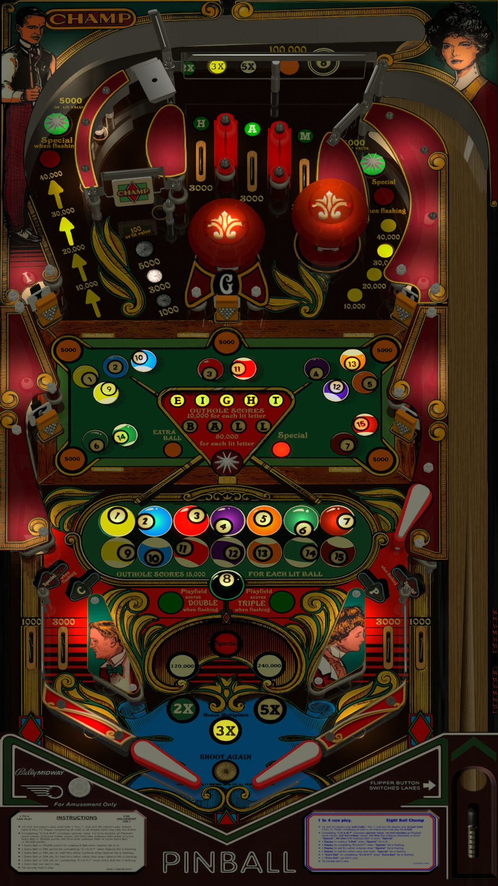

# Eight Ball Champ (Bally 1985)

Authors: [Goldchicco](https://vpuniverse.com/profile/23579-goldchicco/)  
Version: 1.1  
Download: [VP Universe](https://vpuniverse.com/files/file/6633-eight-ball-champ-bally-1985/)

DirectB2S

Authors: [hauntfreaks](https://vpuniverse.com/profile/5216-hauntfreaks/)  
Download: [VPUniverse](https://vpuniverse.com/files/file/18483-eight-ball-champ-bally-1985-b2s/)

ROM

ROM Name: eballchp.zip

Download: [VPForums]( https://www.vpforums.org/index.php?app=downloads&showfile=7323)

SHA1: FC00A3F8A8EF894C9CBD4482274DC29693B0D377

MD5:  530059666882FF4219846E21983C6224 

Tested by: evilwraith

## Status 

Minimum VPX Standalone build: 10.8.0-1989-a764013

| Playfield | Controls | Backglass | DMD | ROM Required | FPS | 
|-----------|----------|-----------|-----|--------------|-----|
| :white_check_mark: | :white_check_mark: | :white_check_mark: | :x: | :white_check_mark: | 51 |

## Instructions

- Install this table through the Table Manager, using the `Add Table` > `Manual` page
- If you need help, more infomation found on the wiki: [TM - Add Table - Manual](https://github.com/LegendsUnchained/vpx-standalone-alp4k/wiki/%5B04%5D-%F0%9F%A7%A1-TM-%E2%80%90-Other-Features#add-table---manual)
- If the table requires any additional files/steps, click `GO TO TABLE` after adding, and the TM will open to the relevant table folder.

