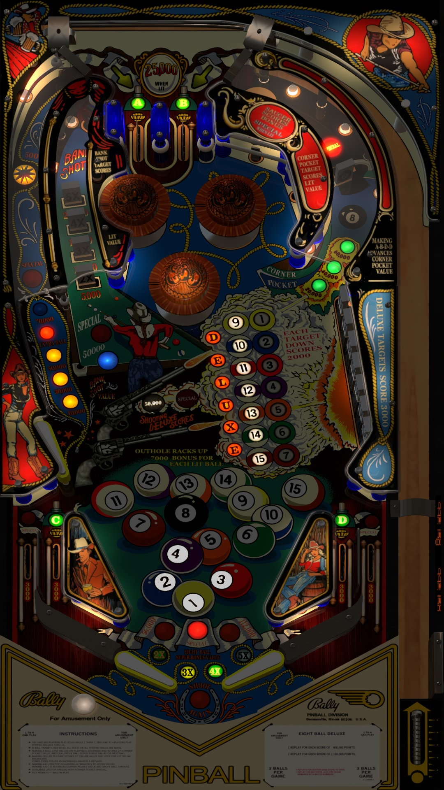

# Eight Ball Deluxe (Bally 1981)

.jpg.69f677a4c09c508397b2fbc6e071d70b.jpg)

Authors: [Goldchicco](https://vpuniverse.com/profile/23579-goldchicco/)
Version: 1.0
Download: [VP Universe](https://vpuniverse.com/files/file/6681-eight-ball-deluxe-bally-1981/)

DirectB2S

Authors: [jwkramer61](https://vpuniverse.com/profile/46356-jwkramer61/)
Version: 1.0
Download: [VP Universe](https://vpuniverse.com/files/file/12361-eight-ball-deluxe-bally-1981-3-screen-b2s-with-active-full-dmd-100/)

ROM

Download: [VP Forums](https://www.vpforums.org/index.php?app=downloads&showfile=259)

## Status 

Minimum VPX Standalone build: 10.8.0-1989-a764013
| Playfield | Controls | Backglass | DMD | ROM Required | FPS | 
|-----------|----------|-----------|-----|--------------|-----|
| :white_check_mark: | :white_check_mark: | :white_check_mark: | :x: | :white_check_mark: | 45 |

## Instructions

- Copy the contents of this repo folder to your USB drive
- Add your personalized launcher.elf and rename it to vpx-eightballdeluxe.elf
- Download the table and directb2s versions listed above and copy them into this folder
