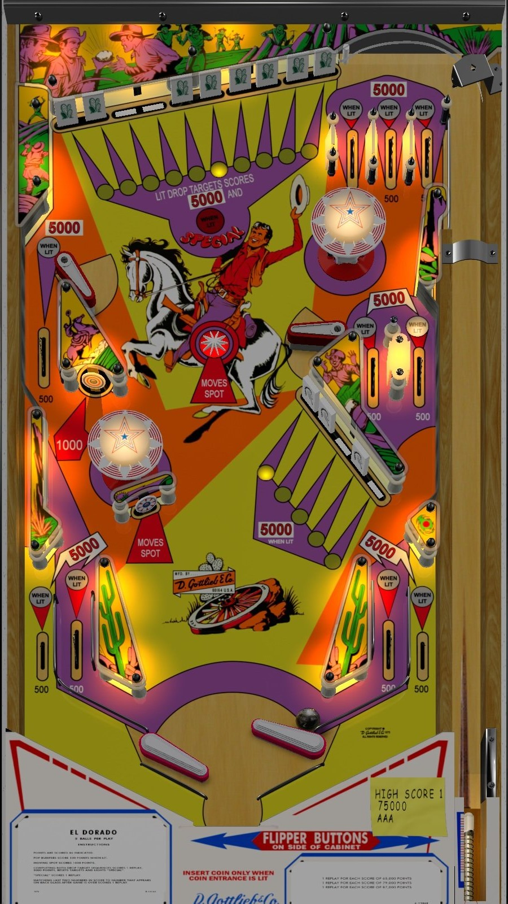

# El Dorado (Gottlieb 1975)

Authors: [teisen](https://vpuniverse.com/profile/31525-teisen/)  
Version: 1.1  
Download: [VPUniverse](https://vpuniverse.com/files/file/15760-el-dorado-gottlieb-1975_teisen_mod/)

DirectB2S

Authors: [Wildman](https://vpuniverse.com/profile/5-wildman/)  
Download: [VPUniverse](https://vpuniverse.com/files/file/15733-el-dorado-gottlieb-1975/)

ROM

None

Tested by: evilwraith

## Status 

Minimum VPX Standalone build: 10.8.0-1989-a764013

| Playfield | Controls | Backglass | DMD | ROM Required | FPS | 
|-----------|----------|-----------|-----|--------------|-----|
| :white_check_mark: | :white_check_mark: | :white_check_mark: | :x: | :x: | 43 |

## Instructions

- Copy the contents of this repo folder to your USB drive
- Add your personalized launcher.elf and rename it to vpx-eldorado.elf
- Download the table and directb2s listed above, extract (if necessary) and copy to external/vpx-eldorado
- Make sure (.vpx), (.directb2s), and (.ini) files are all named the same
