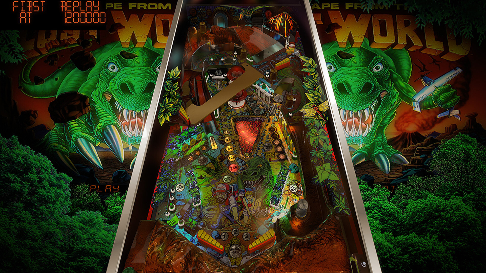

# Escape from the Lost World (Bally 1988)
Tested by: kaoticBPR

Authors: [rajojoey](https://vpuniverse.com/profile/9989-rajojoey/)
Version: 1.0.1
Download: [VPUniverse](https://vpuniverse.com/files/file/10590-escape-from-the-lost-world-bally-1988vr-room/)

DirectB2S

Authors: [hauntfreaks](https://vpuniverse.com/profile/5216-hauntfreaks/)
Version: 1.0.0
Download: [VPuniverse](https://vpuniverse.com/files/file/14352-escape-from-the-lost-world-bally-1987-b2s/)

ROM

Download: [vpforums](http://www.vpforums.org/index.php?app=downloads&showfile=719)
ROM Name and version: esclwrld

## Status 

Minimum VPX Standalone build: 10.8.0-1989-a764013
| Playfield | Controls | Backglass | DMD | ROM Required | FPS | 
|-----------|----------|-----------|-----|--------------|-----|
| :white_check_mark: | :white_check_mark: | :white_check_mark: | :white_check_mark: | :white_check_mark: | 50 |

## Instructions

- "Escape from the Lost World"

