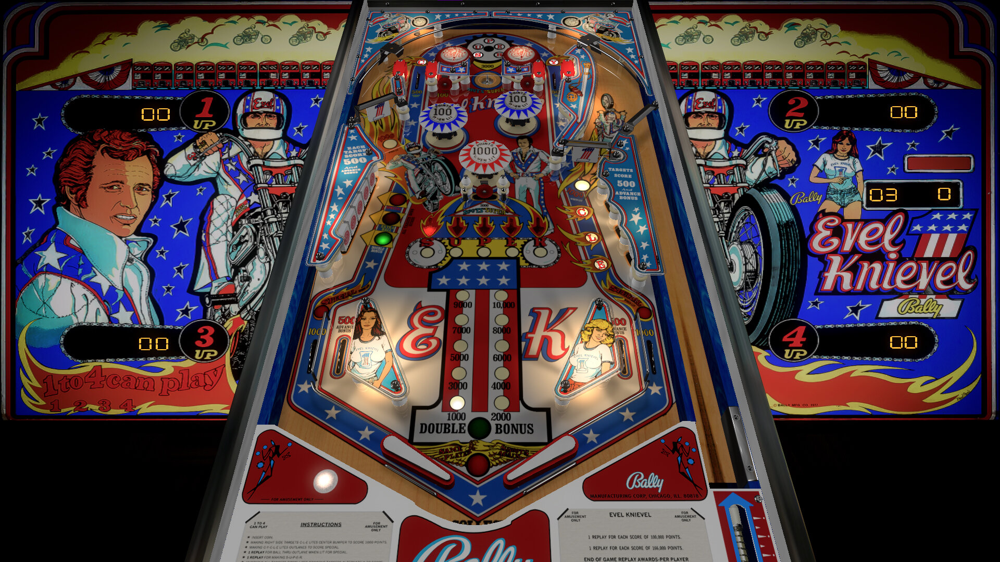

# Evel Knievel (Bally 1977)

 

Table

Author: [hauntfreaks](https://vpuniverse.com/profile/5216-hauntfreaks/)  
Filename:  Evel Knievel (Bally 1977) 5.0.vpx.zip  
VPX Version: (V5.0) Evel Knievel (Bally 1977) 5.0.vpx  
Download: [VPUniverse](https://vpuniverse.com/files/file/16372-evel-knievel-bally-1977v50/?tab=reviews&sort=newest#review-15432) 

Backglass

Author: [hauntfreaks](https://vpuniverse.com/profile/5216-hauntfreaks/)  
Filename: Evel Knievel (Bally 1977).zip  
VPX Version: (V1.0.0) Evel Knievel (Bally 1977).directb2s  
Download: [VPUniverse](https://vpuniverse.com/files/file/16371-evel-knievel-bally-1977-b2s/) 

ROM

Author: [destruk](https://www.vpforums.org/index.php?showuser=5)  
Evel Knievel - ROM  
Filename: evelknie.zip  
Download: [VP Forums](https://www.vpforums.org/index.php?app=downloads&showfile=709) 

MD5: 0A4EE8DE5FAE09245480C03F66B8F2F6  
SHA-1: 9D218CE28FA45F1555052ECC18C48DA5C82FB1CD 
  
Tested and Fixed by:  
[TechZombie] 

## Status 

Minimum VPX Standalone build: 10.8.0-1983-b84441e

| Playfield | Controls | Backglass | DMD | ROM Required | FPS | 
|-----------|----------|-----------|-----|--------------|-----|
| :white_check_mark: | :white_check_mark: | :white_check_mark: | :x: | :white_check_mark: | 50 |

## Instructions

**This table contains a few audio errors (error 21: no 3D support) that should be fixed in a future VPX Standalone Update**
- Copy the contents of this repo folder to your USB drive
- Add your personalized launcher.elf and rename it to vpx-evelknievel.elf
- Download the table and directb2s files above, extract (If Necessary) and copy/move into /external/vpx-evelknievel
- Make sure (.vpx), (.directb2s), and (.ini) files are all named the same
- Download the rom (evelknie.zip) which stays in zip folder, place zip file in vpx-evelknievel/pinmame/roms
- "When you're mad at someone, it's probably best not to break his arm with a baseball bat." - Evel Knievel 

