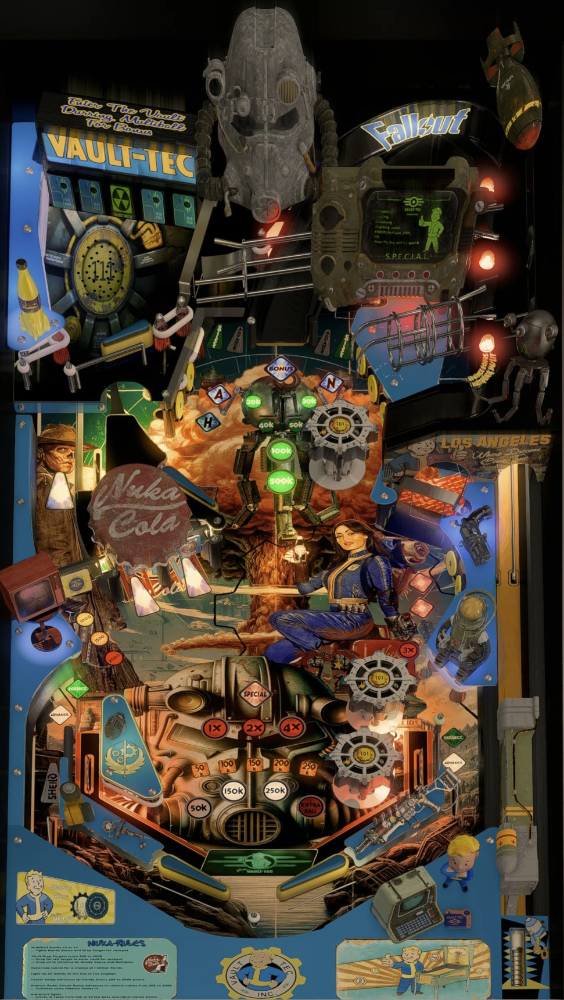

# Fallout Vault Edition (Original 2024)

Authors: [LTek](https://vpuniverse.com/profile/67685-ltek/)  
Version: 2.0  
Download: [VP Universe](https://vpuniverse.com/files/file/21709-fallout-vault-edition-20-ltek-2024/)

DirectB2S

Authors: [hauntfreaks](https://vpuniverse.com/profile/5216-hauntfreaks/)  
Version: 1.0  
Download: [VP Universe](https://vpuniverse.com/files/file/21710-fallout-vault-edition-ltek-2024-b2s-full-dmd/)

PUPPack

Authors: [GtecArcade](https://vpuniverse.com/profile/57286-gtecarcade/)  
Version: 2.0  
Download: [VP Universe](https://vpuniverse.com/files/file/20245-fallout-pup-pack-vault-edition/)

ROM

Included in table download

## Status 

Minimum VPX Standalone build: 10.8.0-2042-1431983

| Playfield | Controls | Backglass | DMD | ROM Required | FPS | 
|-----------|----------|-----------|-----|--------------|-----|
| :white_check_mark: | :white_check_mark: | :white_check_mark: | :white_check_mark: | :white_check_mark: | 45 |

## Instructions

- Copy the contents of this repo folder to your USB drive.
- Add your personalized launcher.elf and rename it to vpx-fallout.elf
- Download the "Fallout Vault Edition 2.0 (LTek 2024).zip" file and only extract the "Fallout Vault Edition 2.0 (LTek 2024).vpx" to the vpx-fallout folder.
- Extract "Fallout.FlexDMD" folder from the zip to the vpx-fallout folder.
- Copy the "ROM/swrds_l2.zip" rom file (do not extract) from the zip to vpx-fallout/pinmame/rom folder.
- Download the directb2s "Fallout Vault Edition (LTek 2024).zip" version listed above and extract the .directb2s file it to the vpx-fallout folder
- Make sure (.vpx) (.directb2s) (.vbs) and (.ini) are all named the same.
- Download "Fallout MUSIC ONLY Pup for NON-PUP Users.rar" puppack listed above.
- In your vpx-fallout folder, create a new folder named pupvideos.
- Extract "fallout" folder from the puppack zip into the pupvideos folder you created.
- __Make sure you copied the pinmame/nvram/swrds_l2.nv from the repo otherwise the table does not start.__
- With the left direction you can display the nuka rules and with the right direction you can change the music track.
- Drink a nuka cola.
