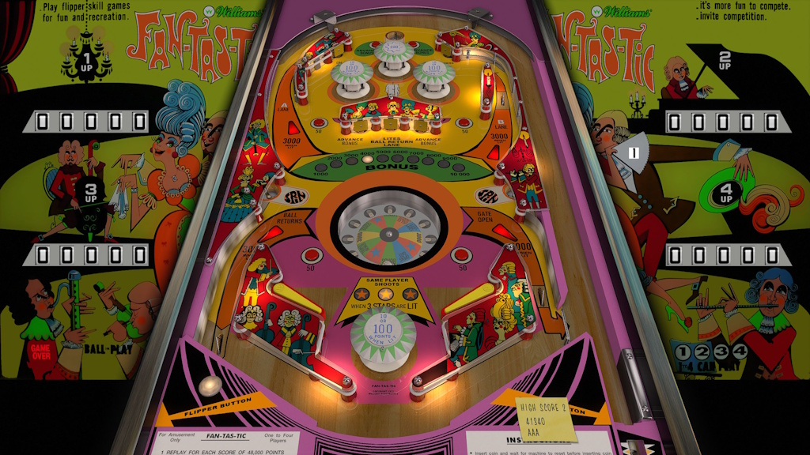

# Fan-Tas-Tic (Williams 1972)

Authors: [jpsalas](https://www.vpforums.org/index.php?showuser=277)  
Version: 1.0.1  
Download: [VPForums](https://www.vpforums.org/index.php?app=downloads&showfile=18630)

DirectB2S

In table link

ROM

None

Tested by: evilwraith

## Status 

Minimum VPX Standalone build: 10.8.0-1989-a764013

| Playfield | Controls | Backglass | DMD | ROM Required | FPS | 
|-----------|----------|-----------|-----|--------------|-----|
| :white_check_mark: | :white_check_mark: | :white_check_mark: | :x: | :x: | 60 |

## Instructions

- Copy the contents of this repo folder to your USB drive
- Add your personalized launcher.elf and rename it to vpx-fantastic.elf
- Download the table and directb2s listed above, extract (if necessary) and copy them to external/vpx-fantastic
- Make sure (.vpx), (.directb2s), and (.ini) files are all named the same
- "Fantastic"

