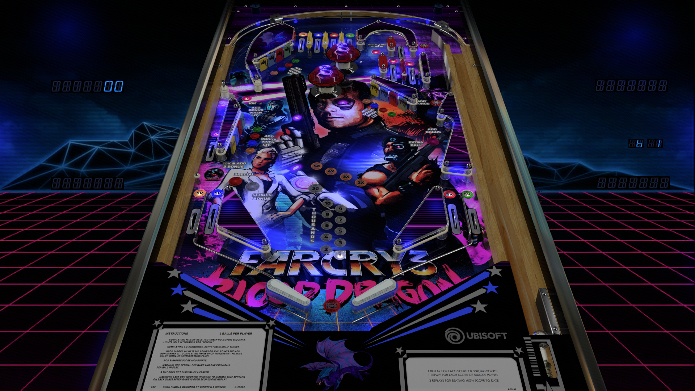

# Far Cry 3 - Blood Dragon (Original 2018)

Authors: [ivantba](https://www.vpforums.org/index.php?showuser=123858)  
Download File Name:  Far Cry 3 Blood Dragon (TBA 2018).rar  
Filename: Far Cry 3 Blood Dragon (TBA 2018).vpx  
Download: [VP Forums](https://www.vpforums.org/index.php?app=downloads&showfile=13657)

DirectB2S included with Table.rar file. 

ROM

Authors: [Rock-ola]  
Filename: panther7.zip  
Download: [VP Forums](https://pinballnirvana.com/forums/resources/panther7.2147/)

Tested by: TechZombie

## Status 

Minimum VPX Standalone build: 10.8.0-1989-a764013

| Playfield | Controls | Backglass | DMD | ROM Required | FPS | 
|-----------|----------|-----------|-----|--------------|-----|
| :white_check_mark: | :white_check_mark: | :white_check_mark: | :x: | :white_check_mark: | 60 |

## Instructions

- Install this table through the Table Manager, using the `Add Table` > `Manual` page
- If you need help, more information found on the wiki: [TM - Add Table - Manual](https://github.com/LegendsUnchained/vpx-standalone-alp4k/wiki/%5B04%5D-%F0%9F%A7%A1-TM-%E2%80%90-Other-Features#add-table---manual)
- If the table requires any additional files/steps, click `GO TO TABLE` after adding, and the TM will open to the relevant table folder.
- Select/Copy music Folder and move to external/vpx-farcry3
- Sgt. Rex 'Power' Colt: "I'm tucking you into your death bed, and your blanket is six feet of my shit."

