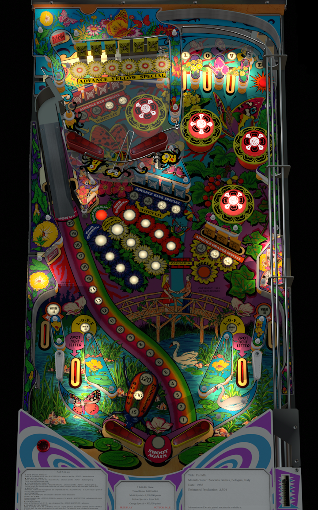

# Farfalla (Zaccaria 1983)

Authors: [kiwi](https://www.vpforums.org/index.php?showuser=30913)  
Version: 1.0.1  
Download: [VP Forums](https://www.vpforums.org/index.php?app=downloads&showfile=14103)

DirectB2S

Authors: [LoadedWeapon](https://www.vpforums.org/index.php?showuser=60392)  
Version: 1.1  
Download: [VP Forums](https://www.vpforums.org/index.php?app=downloads&showfile=9680)

ROM

Download: [VP Forums](https://www.vpforums.org/index.php?app=downloads&showfile=612)

## Status 

Minimum VPX Standalone build: 10.8.0-2042-1431983

| Playfield | Controls | Backglass | DMD | ROM Required | FPS | 
|-----------|----------|-----------|-----|--------------|-----|
| :white_check_mark: | :white_check_mark: | :x: | :white_check_mark: | :white_check_mark: | 45 |

## Instructions

- Make sure to use the Table Manager to install this table.
- Instructions can be found on the wiki [Add Table - Manual](https://github.com/LegendsUnchained/vpx-standalone-alp4k/wiki/%5B04%5D-%F0%9F%A7%A1-TM-%E2%80%90-Other-Features#add-table---manual)
- If the table requires any additional files/steps, click `GO TO TABLE` after adding, and the TM will open to the relevant table folder.
- "For this score... no comment"

