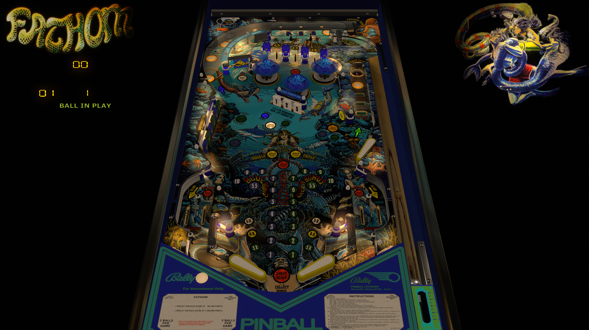

# Fathom (Bally 1981)

Authors: [Goldchicco](https://vpuniverse.com/profile/23579-goldchicco/)  
Version: 1.1b
Download: [VPUniverse](https://vpuniverse.com/files/file/6841-fathom-bally-1981/)

DirectB2S

Authors: [RetroRichie](https://vpuniverse.com/profile/52743-retroritchie/)  
Version:  1.0.0
Download: [VPUniverse](https://vpuniverse.com/files/file/16074-fathom-bally-1981-3d-anaglyph-full-dmd-and-backglass-scoring-b2s/)
*download the backglass scoring version, fulldmd version is currently not supported in VPX standalone.

ROM

Authors: [Destruk](https://www.vpforums.org/index.php?showuser=5)  
Version:  Fathom.zip
Download: [VPforums](https://www.vpforums.org/index.php?app=downloads&showfile=661)

**Testers:** [kaoticBPR] & [OminousOsie]

## Status 

Minimum VPX Standalone build: 10.8.0-1989-a764013
| Playfield | Controls | Backglass | DMD | ROM Required | FPS | 
|-----------|----------|-----------|-----|--------------|-----|
| :white_check_mark: | :white_check_mark: | :white_check_mark: | :white_check_mark: | :white_check_mark: | 38 |

## Instructions

- Copy the contents of this repo folder to your USB drive
- Add your personalized launcher.elf and rename it to vpx-fathom.elf
- Download the table and directb2s versions listed above and copy them into this folder
- Download and place the rom zip (fathom.zip) in the external/vpx-fathom/pinmame/roms folder
"Capture the Mermaids"
