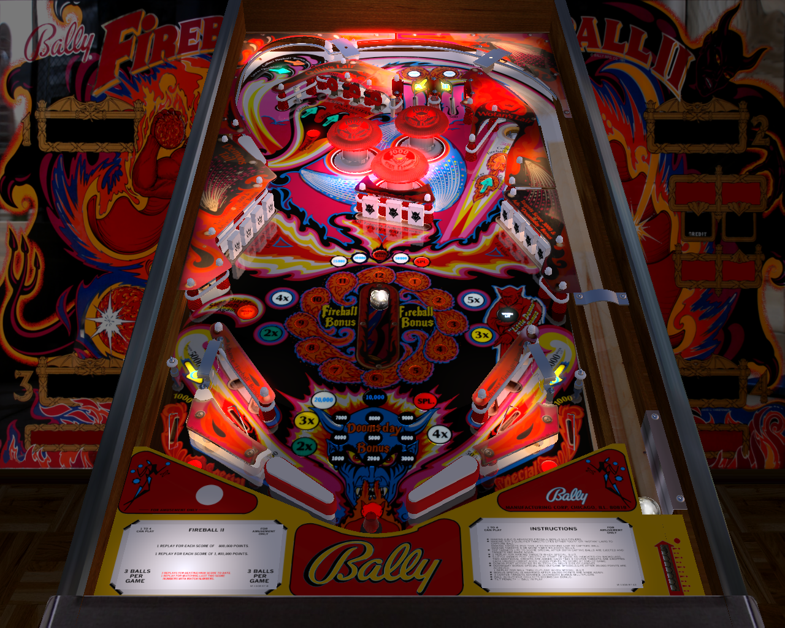

# Fireball II (Bally 1981)

Authors: [Rajo Joey](https://www.vpforums.org/index.php?showuser=80054)  
Version: 1.0.1  
Download: [VPForums](https://www.vpforums.org/index.php?app=downloads&showfile=15936)

DirectB2S

Authors: [hauntfreaks](https://vpuniverse.com/profile/5216-hauntfreaks/)  
Download: [VPForums](https://www.vpforums.org/index.php?app=downloads&showfile=12182)

ROM

ROM Name: fball_ii.zip  
Download: [VPForums](https://www.vpforums.org/index.php?app=downloads&showfile=149)

SHA1: 2CCB2DEFE3C4DF2A79F9C60EC24FE28D08C2D12A  
MD5:  4CFC545E2D42458233C8AC9F9216A055 

Tested by: evilwraith

## Status 

Minimum VPX Standalone build: 10.8.0-1989-a764013

| Playfield | Controls | Backglass | DMD | ROM Required | FPS | 
|-----------|----------|-----------|-----|--------------|-----|
| :white_check_mark: | :white_check_mark: | :white_check_mark: | :x: | :white_check_mark: | 55 |

## Instructions

- Copy the contents of this repo folder to your USB drive
- Add your personalized launcher.elf and rename it to vpx-fireballii.elf
- Download the table and directb2s listed above, extract (if necessary) and copy to external/vpx-fireballii
- Make sure (.vpx), (.directb2s), and (.ini) files are all named the same
- The ROM zip file gets copied to vpx-fireballii/pinmame/roms (Do not unzip)
