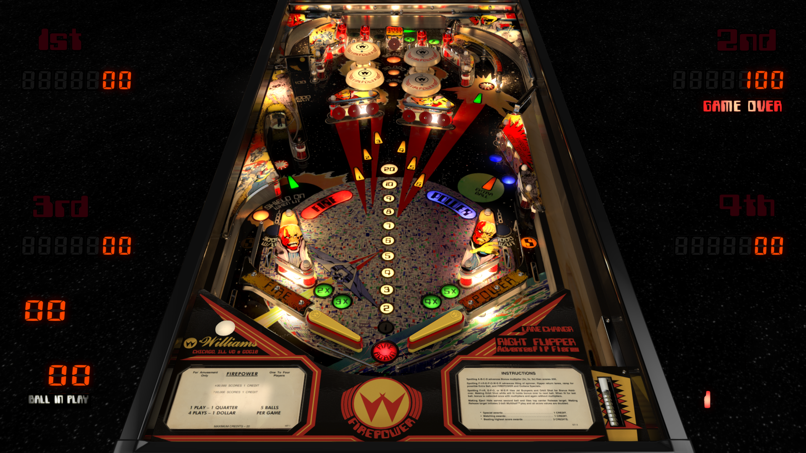

# Firepower (Williams 1980)
TESTED: kaoticBPR

Authors: [3rdaxis](https://www.vpforums.org/index.php?showuser=91493)  
Version: V1.0.5 
Download: [VPforums](https://www.vpforums.org/index.php?app=downloads&showfile=13971)

DirectB2S

Authors: [jwkramer61](https://vpuniverse.com/profile/46356-jwkramer61/)  
Version:  1.0.0
Download: [VPUniverse](https://vpuniverse.com/files/file/14130-firepower-williams-1980-b2s-with-full-active-dmd/)

ROM

Authors: [Destruk](https://www.vpforums.org/index.php?showuser=5)  
Version:  frpwr_b7
Download: [VPforums](https://www.vpforums.org/index.php?app=downloads&showfile=794)

*Make sure the rom you are downloading is frpwr_b7

## Status 

Minimum VPX Standalone build: 10.8.0-1989-a764013
| Playfield | Controls | Backglass | DMD | ROM Required | FPS | 
|-----------|----------|-----------|-----|--------------|-----|
| :white_check_mark: | :white_check_mark: | :white_check_mark: | :white_check_mark: | :white_check_mark: | 56 |

## Instructions

- Copy the contents of this repo folder to your USB drive
- Add your personalized launcher.elf and rename it to vpx-firepower.elf
- Download the table and directb2s versions listed above and copy them into this folder
- The Classic requested by many!
