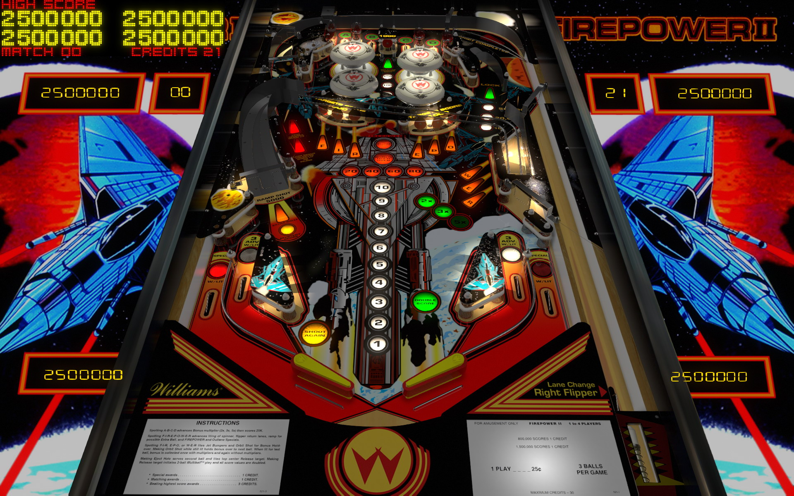

# Firepower II (Williams 1983)
TESTED: kaoticBPR

Authors: [Bigus1](https://www.vpforums.org/index.php?showuser=107629)  
Version: V1.4 
Download: [VPforums](https://www.vpforums.org/index.php?app=downloads&showfile=17049)

DirectB2S

Authors: [hauntfreaks](https://vpuniverse.com/profile/5216-hauntfreaks/)  
Version:  2.0.0 (FirePower II (Williams 1983) 2scn.zip)
Download: [VPUniverse](https://vpuniverse.com/files/file/12923-firepower-ii-williams-1983/) 'FirePower II (Williams 1983) 2scn.zip'

ROM

Authors: [Destruk](https://www.vpforums.org/index.php?showuser=5)  
Version:  fpwr2_l2
Download: [VPforums](https://www.vpforums.org/index.php?app=downloads&showfile=808)

## Status 

Minimum VPX Standalone build: 10.8.0-1989-a764013
| Playfield | Controls | Backglass | DMD | ROM Required | FPS | 
|-----------|----------|-----------|-----|--------------|-----|
| :white_check_mark: | :white_check_mark: | :white_check_mark: | :white_check_mark: | :white_check_mark: | 60 |

## Instructions

- Copy the contents of this repo folder to your USB drive
- Add your personalized launcher.elf and rename it to vpx-firepower2.elf
- Download the table and directb2s versions listed above and copy them into this folder
- The Sequel to the Classic is also a Classic
