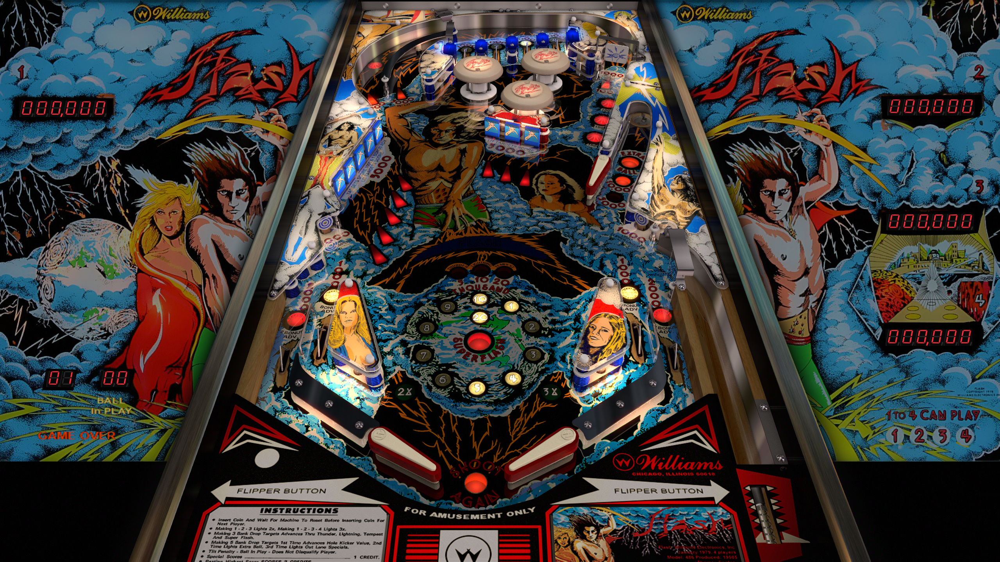

# Flash (Williams 1979)

Authors: [JPSalas](https://www.vpforums.org/index.php?showuser=277)  
Version: 5.5.0  
Download: [VPforums](https://www.vpforums.org/index.php?app=downloads&showfile=12024)

DirectB2S

Authors: [hauntfreaks](https://vpuniverse.com/profile/5216-hauntfreaks/)  
Version:  1.0.0  
Download: [VPUniverse](https://vpuniverse.com/files/file/14340-flash-williams-1979-b2s/)

ROM

Authors: [Destruk](https://www.vpforums.org/index.php?showuser=5)  
Version:  flash_l1  
Download: [VPforums](http://www.vpforums.org/index.php?app=downloads&showfile=758)

TESTED: kaoticBPR, shaver (v5.5.0)

## Status 

Minimum VPX Standalone build: 10.8.0-1989-a764013

| Playfield | Controls | Backglass | DMD | ROM Required | FPS | 
|-----------|----------|-----------|-----|--------------|-----|
| :white_check_mark: | :white_check_mark: | :white_check_mark: | :x: | :white_check_mark: | 60 |

## Instructions

- Install this table through the Table Manager, using the `Add Table` > `Manual` page
- If you need help, more information found on the wiki: [TM - Add Table - Manual](https://github.com/LegendsUnchained/vpx-standalone-alp4k/wiki/%5B04%5D-%F0%9F%A7%A1-TM-%E2%80%90-Other-Features#add-table---manual)
- If the table requires any additional files/steps, click `GO TO TABLE` after adding, and the TM will open to the relevant table folder.
- "Hot Voltage Action!"

