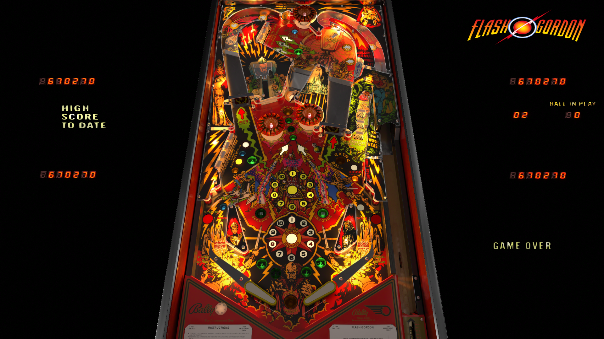

# Flash Gordon (Bally 1981) 2.0.2

Author(s): [rothbauerw](https://vpuniverse.com/profile/10798-rothbauerw/)  
Version: Flash Gordon (Bally 1981) 2.0.2.zip
Download:  [VPUniverse](https://vpuniverse.com/files/file/11584-flash-gordon-bally-1981/)

DirectB2S

Version: Flash Gordon (Bally 1981) Blacksad B2S.zip

Author(s): [Blacksad](https://vpuniverse.com/profile/9127-blacksad/)  
Download:  [VPUniverse](https://vpuniverse.com/files/file/11584-flash-gordon-bally-1981/)

ROM:
flashgdn.zip

Author(s): [destruk](https://www.vpforums.org/index.php?showuser=5)  
Download:  [VP Forums](https://www.vpforums.org/index.php?app=downloads&showfile=668)

Tested by:
[TechZombie]

## Status 

Minimum VPX Standalone build: 10.8.0-1983-b84441e
| Playfield | Controls | Backglass | DMD | ROM Required | FPS | 
|-----------|----------|-----------|-----|--------------|-----|
| :white_check_mark: | :white_check_mark: | :white_check_mark: | :white_check_mark: | :white_check_mark: | 35 |

## Instructions

- Copy the contents of this repo folder to your USB drive
- Add your personalized launcher.elf and rename it to vpx-flashgordon.elf
- Download the table and directb2s versions listed above, extract them (if necessary) and copy them into vpx-flashgordon
- Make sure (.vpx) (.direct2b2s) (.vbs) and (.ini) are all named the same. 
- Place flashgdn.zip ROM file in external/vpx-flashgordon/pinmame/roms - DO NOT UNZIP!
- "Klytus, I'm Boooored" --Emperor Ming

