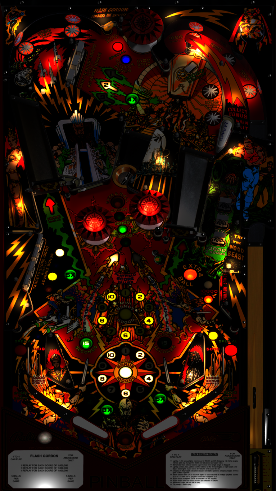

# Flash Gordon (Bally, 1981) Sound MOD v2.1

Author(s): [xenonph](https://vpuniverse.com/profile/8789-xenonph/)  
Version: Flash Gordon (Bally, 1981) Sound MOD v2.1.zip
Download:  [Pinball Nirvana](https://pinballnirvana.com/forums/resources/flash-gordon-bally-1981-sound-mod.6346/)

DirectB2S

Version: Flash Gordon (Bally 1981) Blacksad B2S.zip

Author(s): [hauntfreaks ](https://vpuniverse.com/profile/5216-hauntfreaks/)  
Download:  [VPUniverse](https://vpuniverse.com/files/file/12828-flash-gordon-bally-1981-alt-b2s/)

ROM:
flashgdn.zip

Author(s): [destruk](https://www.vpforums.org/index.php?showuser=5)  
Download:  [VP Forums](https://www.vpforums.org/index.php?app=downloads&showfile=668)

Tested by:
[TechZombie]

## Status 

Minimum VPX Standalone build: 10.8.0-1983-b84441e
| Playfield | Controls | Backglass | DMD | ROM Required | FPS | 
|-----------|----------|-----------|-----|--------------|-----|
| :white_check_mark: | :white_check_mark: | :white_check_mark: | :white_check_mark: | :white_check_mark: | 35 |

## Instructions

- Install this table through the Table Manager, using the `Add Table` > `Manual` page
- If you need help, more information found on the wiki: [TM - Add Table - Manual](https://github.com/LegendsUnchained/vpx-standalone-alp4k/wiki/%5B04%5D-%F0%9F%A7%A1-TM-%E2%80%90-Other-Features#add-table---manual)
- If the table requires any additional files/steps, click `GO TO TABLE` after adding, and the TM will open to the relevant table folder.
- Go fire up your Vpin and enjoy!
- "Gordons Alive!" --Prince Vultan

