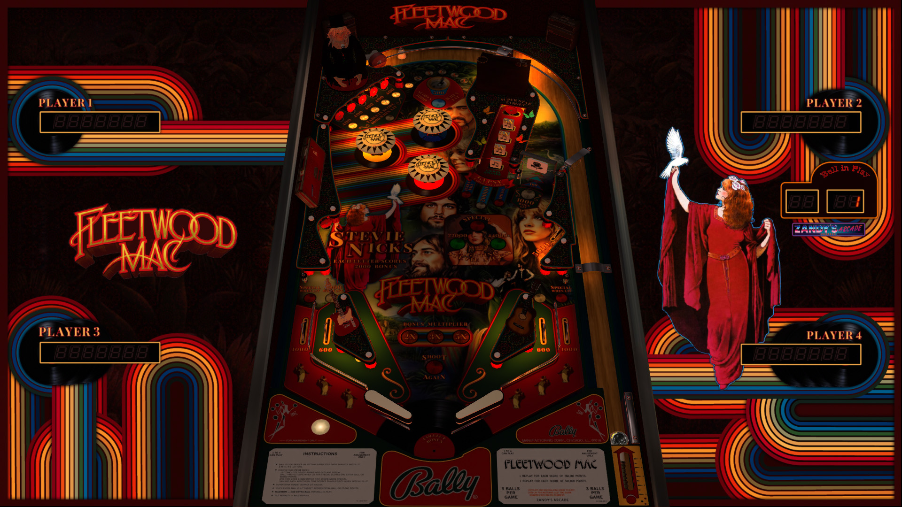

# Fleetwood Mac (Original 2024)

Author: [ZandysArcade](https://vpuniverse.com/profile/57949-zandysarcade/)  
Version: 1.0.0  
Fleetwood.vpx  
Download: [VPUniverse](https://vpuniverse.com/files/file/23024-fleetwood-mac/?tab=reviews&sort=newest#review-28384) 

DirectB2S
Author: [ZandysArcade](https://vpuniverse.com/profile/57949-zandysarcade/)   
Backglass Included with Table above  
Fleetwood.directb2s

ROM
Included with Table in "Media pack.zip": dollyptb.zip

MUSIC
Included with Table in "Media pack.zip": Fleetwood.zip
  
Tested by:  
[psybocilin]

## Status 

Minimum VPX Standalone build: 10.8.0-1989-a764013

| Playfield | Controls | Backglass | DMD | ROM Required | FPS | 
|-----------|----------|-----------|-----|--------------|-----|
| :white_check_mark: | :white_check_mark: | :white_check_mark: | :x: | :white_check_mark: | 52 |

## Instructions

- Copy the contents of this repo folder to your USB drive
- Add your personalized launcher.elf and rename it to vpx-fleetwood.elf
- Download the table and Media pack zips above, extract (if necessary) and copy into /external/vpx-fleetwood
- Make sure (.vpx), (.directb2s), and (.vbs) files are all named the same
- Place dollyptb.zip in the external/vpx-fleetwood/pinmame/roms folder Do Not unzip
- Unzip FLEETWOOD.zip from the Media pack and place folder FLEETWOOD in vpx-fleetwood/music
- Press Start button twice to begin play.  DPad Right changes tracks. 
- "I can still hear you sayin' you would never break the chain"
