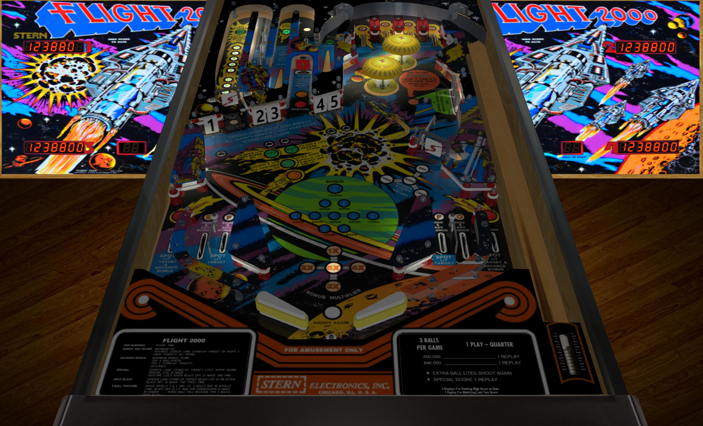

# Flight 2000 (Stern 1980)

Authors: [Bigus](https://www.vpforums.org/index.php?showuser=107629)  
Version: 2.0  
Download: [VPForums](https://www.vpforums.org/index.php?app=downloads&showfile=16799)

DirectB2S

Authors: [htamas](https://www.vpforums.org/index.php?showuser=16933)  
Download: [VPForums](https://www.vpforums.org/index.php?app=downloads&showfile=7683)

ROM

ROM Name: flight2k.zip  
Download: [VPForums](https://www.vpforums.org/index.php?app=downloads&showfile=746)  

SHA1: 6878EF1BD1F855D2318CA382F7C7D2013060BA62  
MD5:  1F4C9DFF8929CA6DB1F58CE872DF09BF

Tested by: evilwraith

## Status 

Minimum VPX Standalone build: 10.8.0-1989-a764013

| Playfield | Controls | Backglass | DMD | ROM Required | FPS | 
|-----------|----------|-----------|-----|--------------|-----|
| :white_check_mark: | :white_check_mark: | :white_check_mark: | :x: | :white_check_mark: | 60 |

## Instructions

- Copy the contents of this repo folder to your USB drive
- Add your personalized launcher.elf and rename it to vpx-flight2000.elf
- Download the table and directb2s listed above, extract (if necessary) and copy to external/vpx-flight2000
- Make sure (.vpx), (.directb2s), and (.ini) files are all named the same
- The ROM zip file gets copied to vpx-flight2000/pinmame/roms (Do not unzip)
