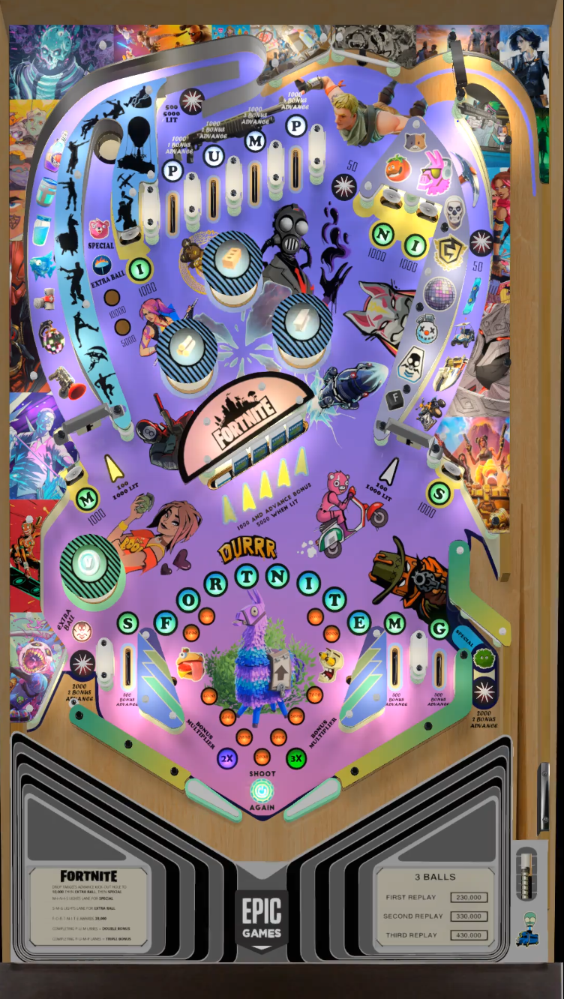

# Fortnite (Original 2024)

 

## *️⃣  Table Statistics

| Playfield | Controls | Backglass | DMD | ROM Required | FPS | 
|-----------|----------|-----------|-----|--------------|-----|
| :white_check_mark: | :white_check_mark: | :white_check_mark: | :x: | :white_check_mark: | 50 |

 

**VPXS 4KP Testers:**
  - TechZombie
  - OminousOsie 🌸
  - CoffeeAtJoes

 

---

 

## ❇️ Available in the Wizard! 🪄✨

 

This table is available through the Table Manager Wizard, which makes installation quick and easy!

### How to install:

1.  Open the **Table Manager**
2.  Click the **Add Table** button
3.  Select the **Wizard** tab
4.  Find and select this table from the dropdown menu: **`Fortnite`**
5.  Follow the on-screen instructions to download and upload the required files

 

Using the Wizard ensures you get the latest table version, have all required files (ROM, backglass, etc.), and have all the VPXS 4KP team's table tweaks and improvements!

__*We hope you enjoy!!   - the VPXS 4KP team!*__

 

---

 

## ➕ Optional Extras

> All optional extras can be added to the table after the Wizard installation via: 
> -  Clicking `"Go to table"` directly after wizard installation
> -  Navigate to the table folder using the `USB Root` tab.

 

### ⏯️ Music Files:

1.  Download table folder from [VP Universe](https://vpuniverse.com/files/file/21107-fortnite-2024/) (by [kangar](https://vpuniverse.com/profile/75869-kangar/)
2.  Extract the folder `Table Music` from the zip, and put it in the `external/vpx-fortnite` in the Table Manager
3.  Rename the folder to `music`
3.  You should then have `external/vpx-fortnite/music` > `Fortnite_Banger.mp3` / `Fortnite_Boss.mp3` / `Fortnite_Bounce.mp3`  etc
4.  Enjoy!

 
 
 
 
 
