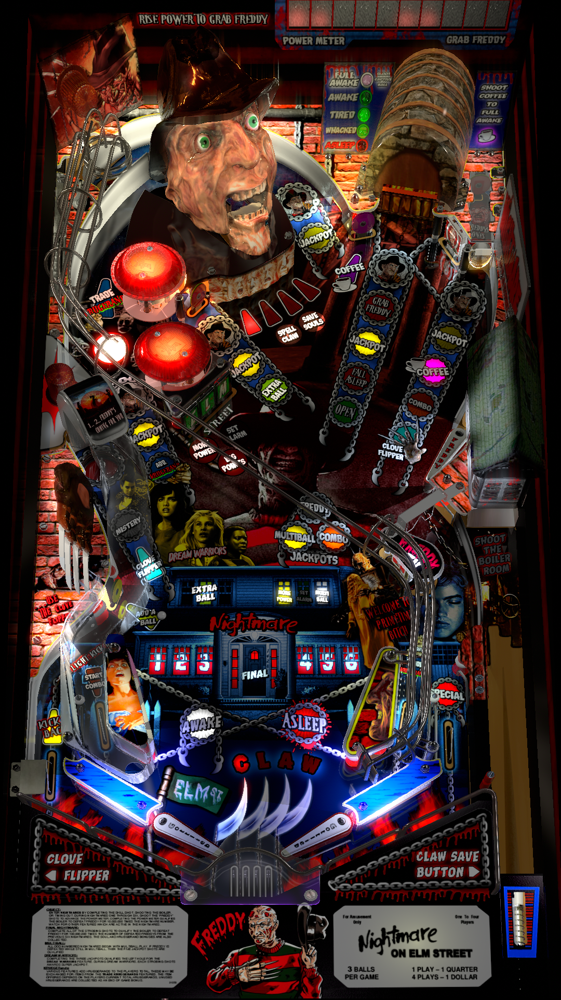

# Freddy A Nightmare on Elm Street (Gottlieb 1994)

Authors: [Siggi](https://vpuniverse.com/profile/8779-siggi/)
Version: 1.2
Download: [VP Universe](https://vpuniverse.com/files/file/8626-freddy-a-nightmare-on-elm-street-siggis-mod/)

DirectB2S

Authors: [hauntfreaks](https://vpuniverse.com/profile/5216-hauntfreaks/)
Version: 1.0
Download: [VP Universe](https://vpuniverse.com/files/file/16558-freddy-a-nightmare-on-elm-street-gottlieb-1994-b2s-with-full-dmd/)

ROM

Download: [Pinball Nirvana](https://pinballnirvana.com/forums/resources/freddy.1835/)

## Status 

Minimum VPX Standalone build: 10.8.0-1989-a764013
| Playfield | Controls | Backglass | DMD | ROM Required | FPS | 
|-----------|----------|-----------|-----|--------------|-----|
| :white_check_mark: | :white_check_mark: | :white_check_mark: | :white_check_mark: | :white_check_mark: | 33 |

## Instructions

- Copy the contents of this repo folder to your USB drive
- Add your personalized launcher.elf and rename it to vpx-freddy.elf
- Download the table and directb2s versions listed above and copy them into this folder
- Make sure (.vpx), (.directb2s), and (.ini) files are all named the same

