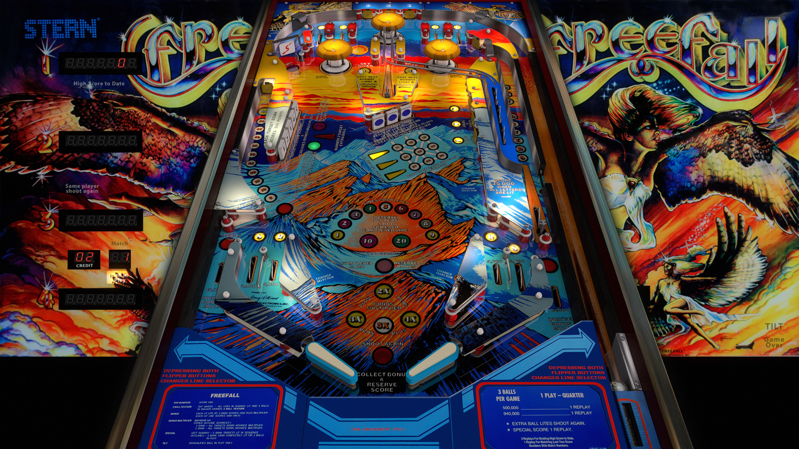

# Freefall (Stern 1981)

Authors: [jpsalas](https://www.vpforums.org/index.php?showuser=277)  
Version: 5.5.0  
Freefall (Stern 1981) v55_VPX8.vpx  
Download: [VP Forums](https://www.vpforums.org/index.php?app=downloads&showfile=12603)

DirectB2S
Authors [darquayle](https://www.vpforums.org/index.php?showuser=51255)  
Version: 1.0  
Freefall (Stern 1981).directb2s    
Download: [VP Forums](https://www.vpforums.org/index.php?app=downloads&showfile=7441)  

ROM
Download: [VP Forums](https://www.vpforums.org/index.php?app=downloads&showfile=749)    
ROM Name and version: freefall.zip  

## Status 

Minimum VPX Standalone build: 10.8.0-1983-b84441e

| Playfield | Controls | Backglass | DMD | ROM Required | FPS | 
|-----------|----------|-----------|-----|--------------|-----|
| :white_check_mark: | :white_check_mark: | :white_check_mark: | :x: | :white_check_mark: | 60 |

## Instructions

- Copy the contents of this repo folder to your USB drive
- Add your personalized launcher.elf and rename it to vpx-freefall.elf
- Download the table and directb2s versions listed above, extract (if necessary) and copy them into the external/vpx-freefall folder
- Make sure (.vpx), (.directb2s) and (.ini) files are all named the same
- Place freefall.zip in the external/vpx-freefall/pinmame/roms folder. DO NOT UNZIP!  

