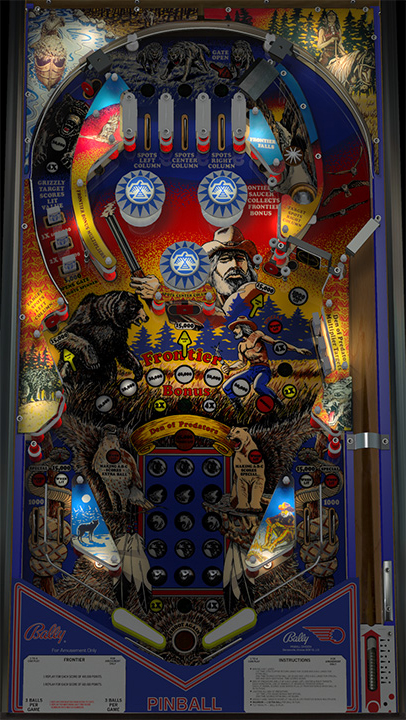

# Frontier (Bally 1980)

Authors: [bord](https://www.vpforums.org/index.php?showuser=83256)\
Version: 1.2\
Download: [VPForums](https://www.vpforums.org/index.php?app=downloads&showfile=12428)

#### DirectB2S

Authors: [hauntfreaks](https://vpuniverse.com/profile/5216-hauntfreaks/)\
Version: 1.0.0\
Download: [VPUniverse](https://vpuniverse.com/files/file/14387-frontier-bally-1980-b2s/)

#### ROM

Download: [VPForums](https://www.vpforums.org/index.php?app=downloads&showfile=672)\
ROM Name and version: `frontier`

Tested by: [GyroJoe](https://github.com/GyroJoe)

## Status 

Minimum VPX Standalone build: 10.8.0-2026-3b68d7c
| Playfield | Controls | Backglass | DMD | ROM Required | FPS | 
|-----------|----------|-----------|-----|--------------|-----|
| :white_check_mark: | :white_check_mark: | :white_check_mark: | :white_check_mark: | :white_check_mark: | 60 |

## Instructions

- "Brings pinball out of the wilderness"

