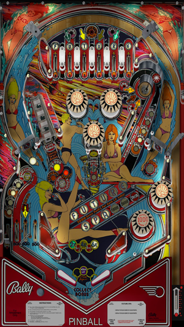

# Future Spa (Bally 1979)

Author: [jpsalas](https://www.vpforums.org/index.php?showuser=277)  
Version: 5.5.0  
Download: [VP Forums](https://www.vpforums.org/index.php?s=3d4ebfb2462744f6ffd97dbd571fe844&app=downloads&showfile=13112)

DirectB2S

Author: [Wildman](https://vpuniverse.com/profile/5-wildman/)  
Download: [VP Universe](https://vpuniverse.com/files/file/2156-future-spabally-1979/)

ROM

Download: [VP Forums](https://www.vpforums.org/index.php?app=downloads&showfile=690)

SHA: d84e5c9b86bf9eadd1f2c8e4001029dc5479ff84  
MD5: 55db2783fccce845deed803c31545e90

Tested by: Mar3nBu

## Status 

Minimum VPX Standalone build: 10.8.0-1983-b84441e

| Playfield | Controls | Backglass | DMD | ROM Required | FPS | 
|-----------|----------|-----------|-----|--------------|-----|
| :white_check_mark: | :white_check_mark: | :white_check_mark: | :x: | :white_check_mark: | 57 |

## Instructions

- Install this table through the Table Manager, using the `Add Table` > `Manual` page
- If you need help, more information found on the wiki: [TM - Add Table - Manual](https://github.com/LegendsUnchained/vpx-standalone-alp4k/wiki/%5B04%5D-%F0%9F%A7%A1-TM-%E2%80%90-Other-Features#add-table---manual)
- If the table requires any additional files/steps, click `GO TO TABLE` after adding, and the TM will open to the relevant table folder.

