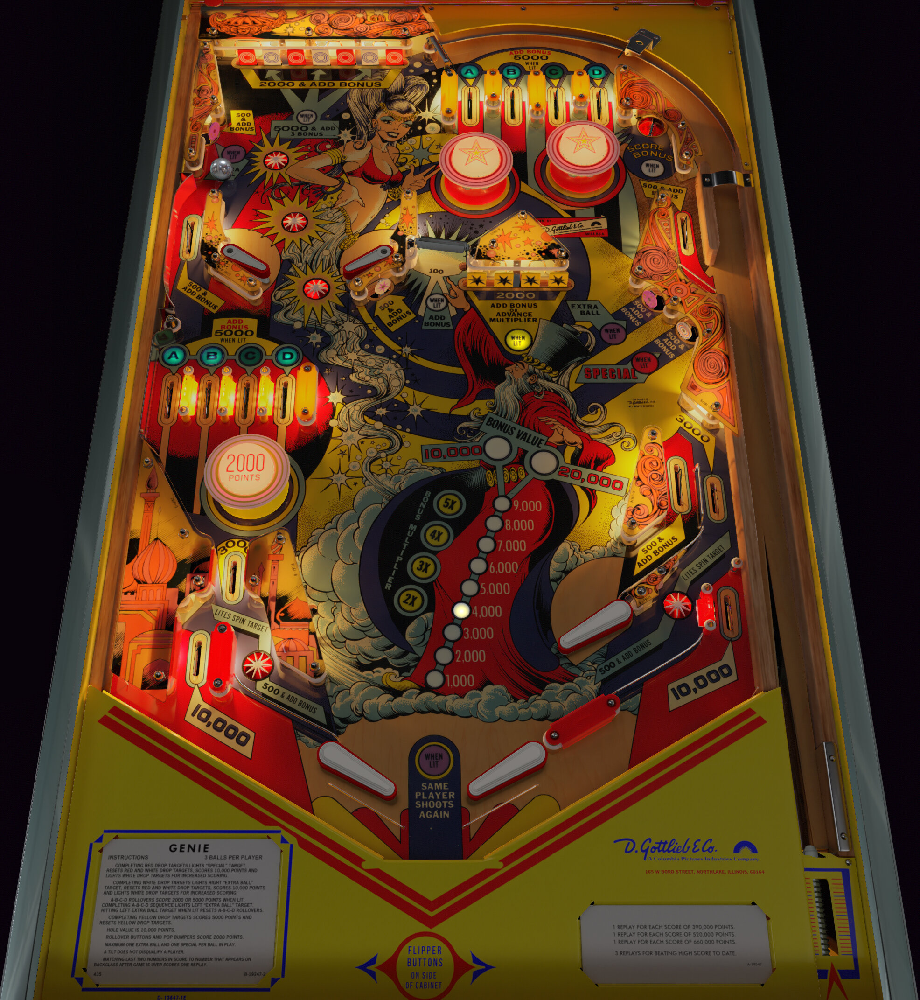

# Genie (Gottlieb 1979)

Authors: [Bigus1](https://www.vpforums.org/index.php?app=core&module=search&do=user_activity&search_app=downloads&mid=107629)  
Version: 2.0  
Download: [VP Universe](https://www.vpforums.org/index.php?app=downloads&showfile=143)

DirectB2S

Authors: [Wildman](https://vpuniverse.com/profile/5-wildman/)  
Download: [VPUniverse](https://vpuniverse.com/files/file/3053-genie-gottlieb-1979/)

ROM

Download Name: genie.zip  
Download: [VP Universe](https://vpuniverse.com/files/file/1184-genie/)

Tested by: evilwraith

## Status 

Minimum VPX Standalone build: 10.8.0-1989-a764013

| Playfield | Controls | Backglass | DMD | ROM Required | FPS | 
|-----------|----------|-----------|-----|--------------|-----|
| :white_check_mark: | :white_check_mark: | :white_check_mark: | :x: | :white_check_mark: | 40 |

## Instructions

- Copy the contents of this repo folder to your USB drive
- Add your personalized launcher.elf and rename it to vpx-genie.elf
- Download the table and directb2s listed above, extract (if necessary) and copy them to external/vpx-genie
- Make sure (.vpx), (.directb2s), (.ini), and (.vbs) files are all named the same
- Copy the genie.zip rom file to vpx-genie\pinmame\roms (Do not unzip)!
- Dream of Genie!

