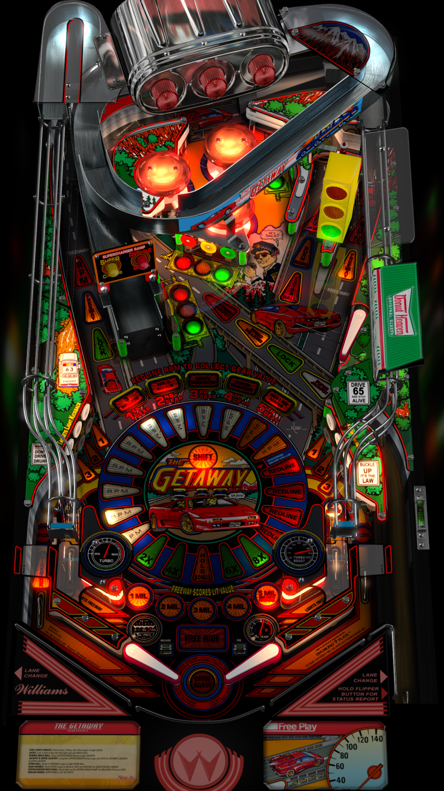

# The Getaway - High Speed II

Author: [ganjafarmer](https://www.vpforums.org/index.php?app=core&module=search&do=user_activity&search_app=downloads&mid=113960)  
Version: 1.2  
Download: [VP Forums](https://www.vpforums.org/index.php?app=downloads&showfile=13130)

DirectB2S

Author: [Hauntfreaks](https://vpuniverse.com/profile/5216-hauntfreaks/)  
Version: 2.0.0  
Download: [VP Universe](https://vpuniverse.com/files/file/11932-the-getaway-high-speed-ii-williams-1992-b2s-with-full-dmd/)

ROM

Download: [VP Forums](https://www.vpforums.org/index.php?app=downloads&showfile=1330)

## Status 

Minimum VPX Standalone build: 10.8.0-1983-b84441e

| Playfield | Controls | Backglass | DMD | ROM Required | FPS | 
|-----------|----------|-----------|-----|--------------|-----|
| :white_check_mark: | :white_check_mark: | :white_check_mark: |:white_check_mark: | :white_check_mark: | 42 |

## Instructions

- Copy the contents of this repo folder to your USB drive
- Add your personalized launcher.elf and rename it to vpx-getaway.elf
- Download the table, ROM and directb2s versions listed above and copy them into this folder
- D-pad up (or joystick up on the arcade control panel) launch the ball and shift gears
- I can't drive 55

