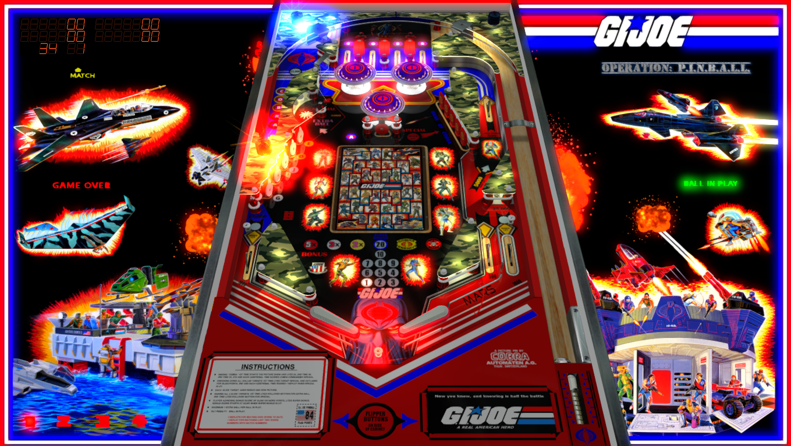

# A Real American Hero - Operation P.I.N.B.A.L.L. (Original 2017)

Authors: [xenonph](https://vpuniverse.com/profile/8789-xenonph/)  
Download File/Version: A Real American Hero (Original 2022) v2.1 VPX7.2.zip  
Filename: A Real American Hero v2.1 VPX7.2.vpx  
Download: [VP Forums](https://vpuniverse.com/files/file/4852-a-real-american-hero-operation-pinball-original-2022/)

DirectB2S Included Wtih Table Zip.

ROM

Authors: [destruk](https://www.vpforums.org/index.php?showuser=5)  
Filename: playboyb.zip  
Download: [VP Forums](https://www.vpforums.org/index.php?app=downloads&showfile=701)

Tested by: TechZombie

## Status 

Minimum VPX Standalone build: 10.8.0-1989-a764013

| Playfield | Controls | Backglass | DMD | ROM Required | FPS | 
|-----------|----------|-----------|-----|--------------|-----|
| :white_check_mark: | :white_check_mark: | :white_check_mark: | :x: | :white_check_mark: | 52 |

## Instructions

- Make sure to use the Table Manager to install this table.
- Instructions can be found on the wiki [Add Table - Manual](https://github.com/LegendsUnchained/vpx-standalone-alp4k/wiki/%5B04%5D-%F0%9F%A7%A1-TM-%E2%80%90-Other-Features#add-table---manual)
- If the table requires any additional files/steps, click `GO TO TABLE` after adding, and the TM will open to the relevant table folder.
- Select/Copy GI JOE Folder and move to music folder
- "Now you know. And knowing is half the battle" - Duke

