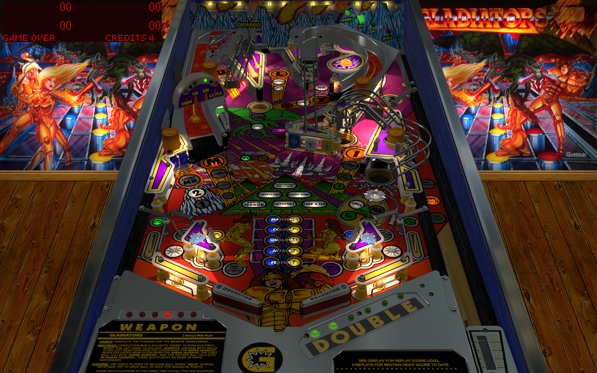

# Gladiators (Gottlieb 1993)

Authors: [kiwi](https://www.vpforums.org/index.php?showuser=30913)
Version: 1.1.1.
Download: [VP Forums](https://www.vpforums.org/index.php?app=downloads&showfile=13868)

DirectB2S

Authors: [hauntfreaks](https://vpuniverse.com/profile/5216-hauntfreaks/)
Version: 1.0
Download: [VP Universe](https://vpuniverse.com/files/file/17770-gladiators-premier-1993-b2s/)

ROM

Download: [Pinball Nirvana](https://pinballnirvana.com/forums/resources/gladiatr.1870/)

## Status 

Minimum VPX Standalone build: 10.8.0-1989-a764013
| Playfield | Controls | Backglass | DMD | ROM Required | FPS | 
|-----------|----------|-----------|-----|--------------|-----|
| :white_check_mark: | :white_check_mark: | :white_check_mark: | :white_check_mark: | :white_check_mark: | 50 |

## Instructions

- Copy the contents of this repo folder to your USB drive
- Add your personalized launcher.elf and rename it to vpx-gladiators.elf
- Download the table and directb2s versions listed above and copy them into this folder
