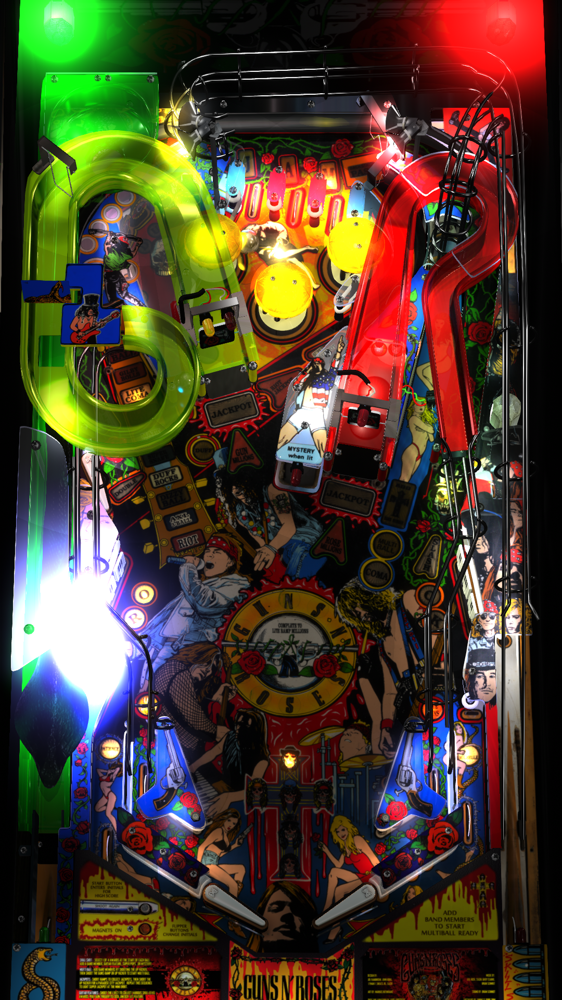

# Guns N Roses (Data East 1994) 

Author: [versins77](https://vpuniverse.com/profile/29661-versins77/)  
Version: 1.03  
Download: [VP Universe](https://vpuniverse.com/files/file/14967-guns-n-roses-data-east-1994/)

DirectB2S

Author: [Hauntfreaks](https://vpuniverse.com/profile/5216-hauntfreaks/)  
Version: 1.5  
Download: [VP Universe](https://vpuniverse.com/files/file/12850-guns-n-roses-data-east-1994-b2s-full-dmd/)

ROM

Download: [VP Forums](https://www.vpforums.org/index.php?app=downloads&showfile=194)  

SHA: 8ee405302de76b27bc97f77289a22e67dfce791b  
MD5: c6f4660fd9af560637bde2df7668b5c4

Alt Color

Author: [ebor](https://vpuniverse.com/profile/29168-ebor/)  
Version: 1.0.1  
Download: [VP Universe](https://vpuniverse.com/files/file/17131-guns-n-roses-data-east-1994-dmd-64-colors-serum-format/)

Tested by: Bla1ze  

## Status 

Minimum VPX Standalone build: 10.8.0-1983-a764013

| Playfield | Controls | Backglass | DMD | ROM Required | FPS | 
|-----------|----------|-----------|-----|--------------|-----|
| :white_check_mark: | :white_check_mark: | :white_check_mark: | :white_check_mark: | :white_check_mark: | 40 |

## Instructions

- Copy the contents of this repo folder to your USB drive
- Add your personalized launcher.elf and rename it to vpx-gnr.elf
- Download the table and directb2s versions listed above, extract (if necessary) and copy them to external/vpx-gnr
- Place ROM zip file into vpx-gnr/pinmame/roms folder. DO NOT UNZIP!
- If using the Alt Color, make altcolor folder in pinmame folder and place the gnr_300 folder with the .cRZ file in it in the altcolor folder
- Of all the bands in the world.... this is definitely one of them! 🔫🌹
